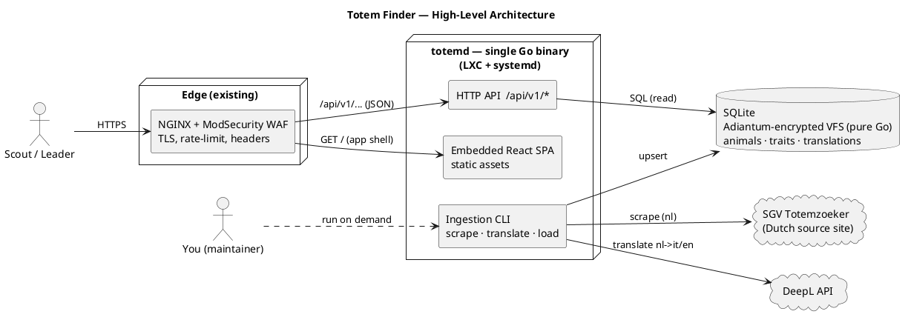
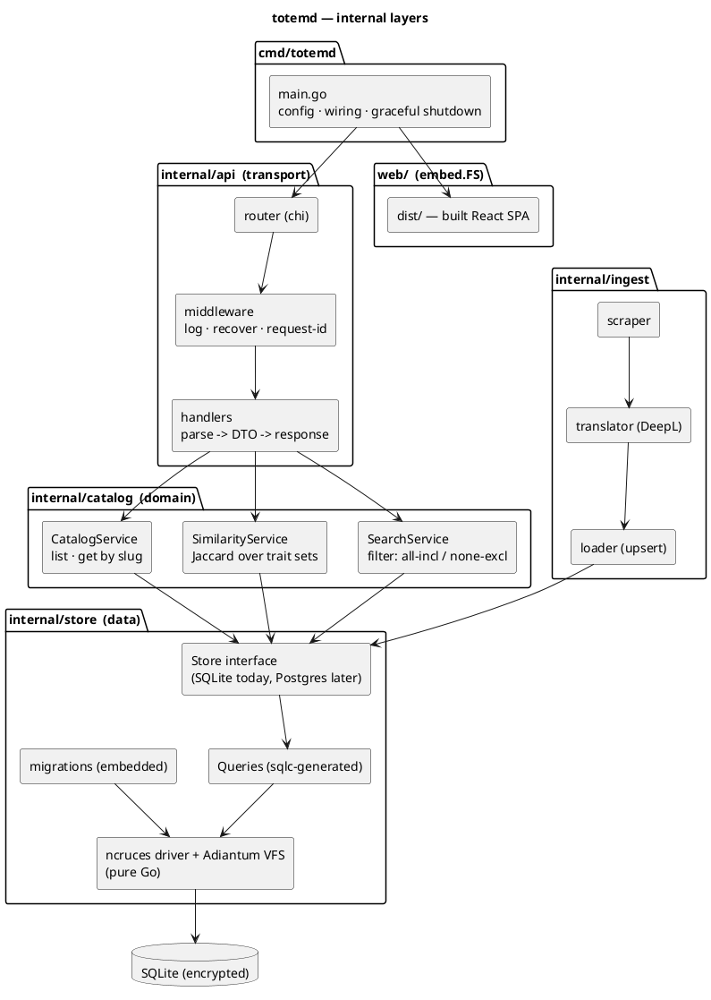
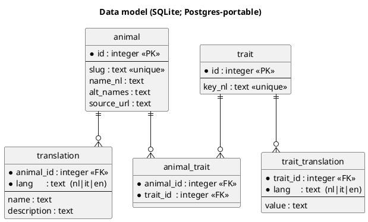
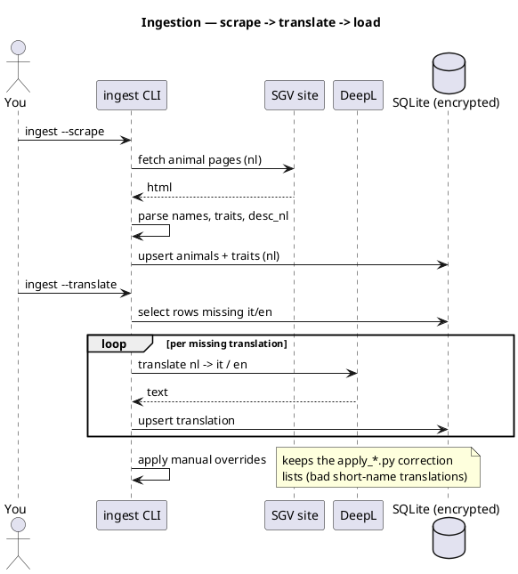
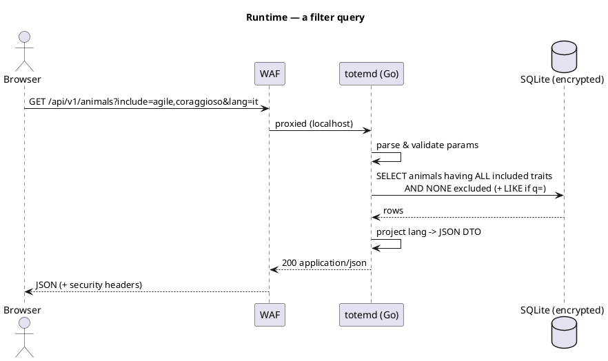
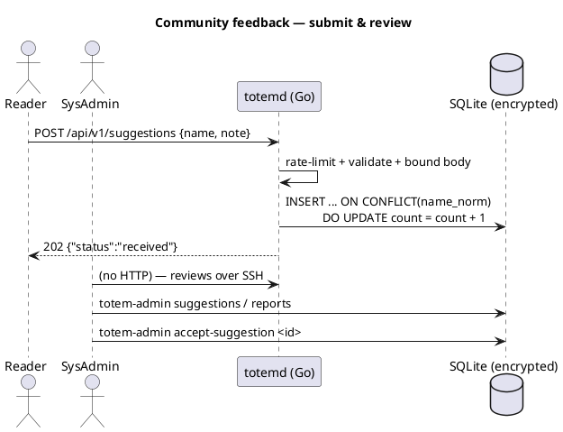
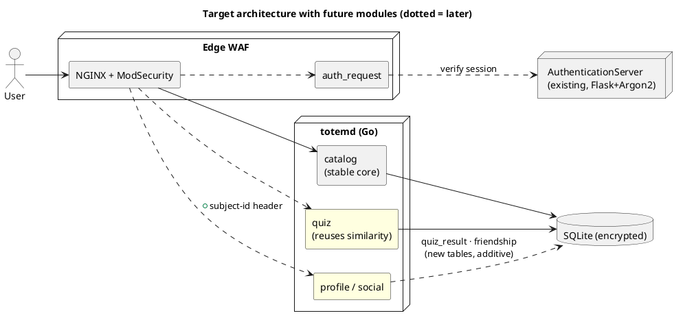
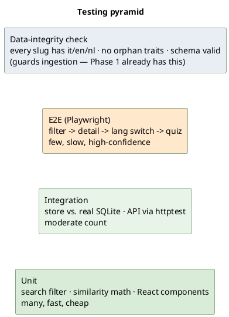
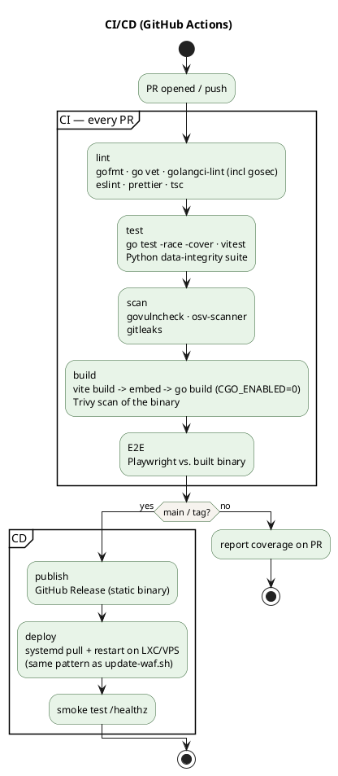
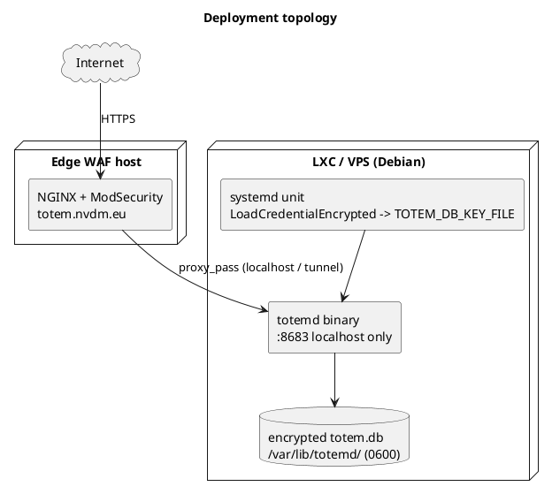

```table-of-contents
```

# Totem Finder (IT)

**Build `0.4.0`** — the version lives in [`VERSION`](VERSION) at the repo root and is the single source of truth. `deploy.sh` reads it and stamps it into both halves: the Go binaries via `-ldflags`, the SPA via a Vite `define` at `npm run build`. Go additionally embeds the commit itself, so a binary always identifies its source, and the full stamp reads `0.4.0+a1b2c3d`.

Both stamps are shown side by side in the game's **`F3` netcode HUD** — client and server separately, because a browser serving a cached bundle is exactly how "did my deploy go out?" becomes ambiguous. A mismatch is highlighted. Bump `VERSION` when you cut a release; a plain `go build` or `npm run build` outside the deploy reports `dev`, which is itself worth knowing.

Italian translation of the Dutch **Scouts en Gidsen Vlaanderen** *Totemzoeker*. A searchable catalogue of 472 animal totems, each with a set of character traits and a description in Italian, English and Dutch. Two search modes: **exact filter** (animals that have *all* included traits and *none* excluded) and **similarity** (animals closest to a chosen trait profile).

This README describes the **target architecture** for the v2 rewrite — a Go backend + React frontend replacing the current single-file static site (see [Current state vs. target](#current-state-vs-target)). It is a living design document; the [Changelog](#changelog) tracks decisions. Work proceeds in [phases](#build-phases), one layer at a time — database and backend are **done**; currently the **frontend** (Phase 3), with the single-binary embed and CI still to come.

## Concepts

Domain terms used throughout this document, defined once here.

- **Totem** — one animal. Identified by its **slug** (`aalscholver`), not its display name, because the same animal has three names (nl/it/en) and the slug is the stable key across all of them and across the individual detail pages.
- **Trait** — a single character attribute (`coraggioso`, `solitario`). Traits are **shared** across animals and **deduplicated** — "coraggioso" is one row, referenced by every brave animal — which is what makes the trait cloud and similarity cheap to compute.
- **Similarity** — the finder's default (and only) mode: pick traits and animals are ranked by how closely their trait set matches (Jaccard overlap), each with a **% match**. Excluded traits still hard-filter. With no traits picked, it just lists everything.
- **Exact filter** — a superset/disjoint set match (has all included, none excluded). Still available on the API (`/api/v1/animals?include=…`) but **not surfaced in the UI** — the Exact/Similar toggle was removed as redundant.
- **Ingestion** — the offline pipeline that turns the source website into rows in the database: **scrape** (pull Dutch data from the SGV site) → **translate** (DeepL, nl→it/en) → **load** (upsert into the DB). Idempotent and re-runnable.
- **Projection** — serving one language. The API stores all three languages but *projects* a single `lang` into each response so the frontend never ships data it won't show. A fetched animal is joined to its `translation` row for that language in the **same query** — one round-trip, not a second fetch.

## Architecture

A three-tier application that slots in behind the existing edge (see [[ReverseProxyWAF]]): the WAF terminates TLS and rate-limits, then proxies to a **single Go binary** (`totemd`) that serves both the JSON API and the compiled React SPA (embedded via `embed.FS`). One artifact to build, one to deploy — a plain static binary dropped onto an LXC with a systemd unit (no Docker; see [Deployment](#deployment)).



| Tier | Technology | Responsibility |
| ---- | ---------- | -------------- |
| Frontend | React + Vite + TypeScript · React Router · TanStack Query · Zustand · react-i18next | Finder UI, filter/similarity modes, animal detail pages, IT/EN/NL switching |
| Backend | Go · `chi` router · `sqlc` · **`ncruces/go-sqlite3` (pure-Go, no CGO)** + **`vfs/adiantum`** | JSON API, search/filter/similarity, serve embedded SPA, ingestion |
| Data | SQLite, **Adiantum-encrypted at rest** | Normalised catalogue; `LIKE` name/text search |
| Ingestion | Python (v1) → Go (later) | scrape → translate → load; idempotent |

**Design Decision — single binary vs. split hosting.** `totemd` embeds the built SPA rather than serving it from a separate static host. Reason: the WAF already does TLS/rate-limiting/headers, so the app needs neither; one binary means no CORS setup, no "frontend and API drifting out of sync", and a trivial deploy. If the frontend ever needs a CDN, splitting it out is a config change, not a rewrite.

### Backend internals

Layered, with dependencies pointing inward (transport → domain → data). This is the shape that teaches idiomatic Go: HTTP concerns never leak into the domain, and the domain never imports the router.



API surface (small on purpose):

| Method / path | Returns |
| ------------- | ------- |
| `GET /api/v1/animals?lang=it&q=lupo` | Filtered list (name / free-text) |
| `GET /api/v1/animals?include=coraggioso,agile&exclude=solitario&lang=it` | Exact-filter mode |
| `GET /api/v1/animals/{slug}?lang=it` | Single animal detail |
| `GET /api/v1/animals/{slug}/similar?lang=it` | Similarity to one animal |
| `GET /api/v1/similar?include=…&exclude=…&lang=it` | Similarity to a chosen trait profile (Similarity mode) |
| `GET /api/v1/traits?lang=it` | Trait cloud for the sidebar |
| `GET /api/v1/emoji` | `{slug: emoji}` map for the finder cards |
| `GET /api/v1/animals/{slug}/image` | Animal image (see [Images](#images)) |
| `GET /healthz` | Liveness (WAF / systemd) |

### Query layer, types & parametrization

The domain talks to a small interface; `*store.Store` implements it, so handlers are testable with a fake and the Postgres swap is additive.

```go
type Catalog interface {
    ListAnimals(ctx, Filter) ([]Animal, error)
    GetAnimal(ctx, slug, lang string) (*AnimalDetail, error)
    Similar(ctx, slug, lang string, limit int) ([]Animal, error)
    ListTraits(ctx, lang string) ([]Trait, error)
}

type Filter struct {
    Lang    string   // it | en | nl (validated at the handler; default "it")
    Query   string   // free-text name match (LIKE)
    Include []string // trait keys the animal must ALL have
    Exclude []string // trait keys the animal must NOT have
}
```

**Design Decision — every SQL value is a bound parameter.** The only place SQL is assembled dynamically is the filter's `IN (…)` clause, where the *number* of placeholders varies: build the `?,?,?` string from `len(Include)`, but bind every trait value as an argument — never interpolate values into SQL. A `go vet` / `golangci-lint` gate in CI enforces this.

### Similarity (Jaccard, in SQL)

Similarity mode ranks animals by **Jaccard overlap** of trait sets:

```
Jaccard(A,B) = |A ∩ B| / |A ∪ B| = shared / (|A| + |B| − shared)
```

Computed in one SQL query (count shared traits via a join on `trait_id`, divide by the union) rather than loading every animal into Go. Dividing by the union normalises for set size, so a trait-heavy animal that happens to share a few traits does not outrank a tighter match. Identical trait sets score 1.0. Example: `adder` (7 traits) vs `schorpioen` (7, 3 shared) → 3 / (7+7−3) = **0.273**.

### Data model

The current JSON is denormalised (trait strings repeated per animal). Normalising deduplicates traits, which makes the trait cloud and similarity trivial and prevents the "same trait spelled two ways" class of bug. This schema is defined in [`internal/store/migrations/`](internal/store/migrations/) and is the single source of truth for both the Python seeder (Phase 1) and the Go store (Phase 2).



**Design Decision — normalised tables vs. JSON columns.** SQLite could store `traits`/`translations` as JSON columns (closer to today's shape, fewer tables). We normalise instead because it is the more instructive relational model, it makes the Postgres migration clean, and 471 rows makes the performance difference irrelevant. Fetching an animal with its localized text stays a single JOIN (see [Projection](#concepts)); an optional `animal_localized` VIEW can hide that join from the Go queries if desired.

### Ingestion pipeline

Replaces the `scripts/*.py` chain. Idempotent: re-running only fills gaps (skip already-translated), mirroring the discipline the current DeepL script already has (`--dry-run`, skip-existing).



### Runtime request flow



## API contract

The full contract is an **OpenAPI 3.1** spec at [`docs/openapi.yaml`](docs/openapi.yaml) (paste into [editor.swagger.io](https://editor.swagger.io) to browse). Summary:

| Method & path | Purpose | Key params / body |
| ------------- | ------- | ----------------- |
| `GET /healthz` | Liveness | — |
| `GET /api/v1/animals` | List / filter | `lang`, `q`, `include`, `exclude` |
| `GET /api/v1/animals/{slug}` | Full detail (multilingual names, image) | `lang` |
| `GET /api/v1/animals/{slug}/similar` | Similar to this animal | `lang`, `limit` (≤50) |
| `GET /api/v1/similar` | Similar to a trait profile | `lang`, `include`, `exclude`, `limit` (≤500) |
| `GET /api/v1/animals/{slug}/image` | Animal image (webp) | — |
| `GET /api/v1/traits` | Trait cloud (grouped synonyms) | `lang` |
| `GET /api/v1/emoji` | slug → emoji map | — |
| `POST /api/v1/suggestions` | Suggest a new animal | `{name, note?}` |
| `POST /api/v1/animals/{slug}/reports` | Report an animal | `{reason, note?}` |
| `POST /api/v1/games/rooms` | Open a game room | — → `{code}` |
| `GET /api/v1/games/ws` | Join a room (WebSocket) | `code`, `name`, `animal` |

Reads are unauthenticated and idempotent. The two writes are public but hardened (see [Community feedback](#community-feedback-suggestions--reports)). Admin review has **no HTTP surface** — it's the `totem-admin` CLI. The game routes are described in [Games](#games-multiplayer).

## Community feedback (suggestions & reports)

Readers can **suggest a new animal** and **report an existing one** (many totems are very Flemish-specific, so an Italian audience will hit unknowns). Both deduplicate and keep a count; a SysAdmin reviews the queue with `totem-admin` over SSH.

**Data model** (migration `0003_feedback.sql`): `suggestion(name, name_norm UNIQUE, note, count, status)` and `report(animal_id, reason, note, count, status, UNIQUE(animal_id, reason))`. Repeat submissions hit the `ON CONFLICT … DO UPDATE SET count = count + 1` upsert instead of inserting duplicates. `status ∈ {pending, accepted, rejected}` and `reason ∈ {incorrect, unknown, poor_description, other}` are enforced by `CHECK` constraints **and** in Go (defence in depth).

**Hardening of the public write path:**
- **No injection surface** — all SQL parameterized; the report `slug` is resolved to an id (unknown slug → 404, so reports can't be seeded for arbitrary strings).
- **Strict input validation** — `name` is 1–60 runes of letters/marks + ``- ' . ( )`` (no digits, no angle brackets); `note` ≤280 runes, no control chars or `< >`. Reject on violation (400).
- **Bounded body** — `http.MaxBytesReader` caps the JSON at 4 KiB; decoder rejects unknown fields and trailing data.
- **Rate limiting** — a per-IP fixed-window limiter (10 writes/min) in front of both endpoints (429 when exceeded), on top of the WAF.
- **No enumeration** — responses are always `202 {"status":"received"}`, so dup/count state isn't leaked.



**Review CLI:**
```
totem-admin [--db PATH] [--status pending|accepted|rejected|all] suggestions
totem-admin [--db PATH] [--status ...]                            reports
totem-admin accept-suggestion <id> | reject-suggestion <id>
totem-admin accept-report <id>     | reject-report <id>
```
It opens the same encrypted DB (needs `TOTEM_DB_KEY`) and lists entries sorted by count.

## Games (multiplayer)

The totem catalog is the content; the games are what gets people to open it at camp. The first one is a **Bomberman-style arena** where up to four players each pick a totem animal and fight on a 15×13 grid.

**Server-authoritative, by design.** Clients send *intent* (a direction and whether the bomb key is down) and render what comes back. All movement, collision, fuses, blasts and deaths are decided by the server, so a tampered client cannot walk through walls, teleport, drop infinite bombs or survive a blast. The cost is one round trip of input latency, which is nothing on the LAN these games are played on.

### Layering

`internal/game` is split so the rules are testable without a network:

| File | Responsibility |
| ---- | -------------- |
| `arena.go` | Static wall lattice + destructible crate layer, generated from a seed |
| `state.go` | Match state and the DTOs that go on the wire |
| `sim.go` | The tick function — a pure `(state, inputs) → state`, no I/O |
| `protocol.go` | Client/server message envelopes |
| `room.go` | One goroutine per room, owning a `Match` and running the tick loop |
| `registry.go` | Room codes → rooms, with idle reaping |
| `internal/api/games.go` | HTTP/WebSocket transport |

Only `room.go` touches concurrency. Each room **owns its `Match` on a single goroutine** and every mutation is funnelled through an action channel, so the simulation needs no locks. Everything that can resolve a tie (who grabs a powerup on the same tick) iterates players in slot order, and crate drops come from a per-match seeded RNG — so a seed reproduces a whole round, which is what the tests lean on.

### Netcode

- **60 Hz** authoritative tick. Every duration in the simulation is expressed in *ticks*, so changing `TickHz` changes only how finely time is sampled, never how long a fuse burns. Snapshots go out every tick during play; the lobby is silent (its state travels in roster frames) so idle rooms cost nothing.
- Snapshots use **single-letter JSON keys**, and the crate layer is sent **only on the ticks where it changed** — WebSocket delivery is ordered, so the client holds the last value it saw. That thinning lives in `Room`, not `Match`: only the Room knows what each client has already received, which is what lets a mid-round joiner be handed the full layer.
- A client that stalls has its snapshots **dropped, not queued**: each one is a complete picture, so the newest is always the one worth having.
- Remote players are rendered **one tick behind** and interpolated between the two most recent snapshots, which turns arrival jitter into smooth motion instead of sprites snapping between tiles. Snapshots live in a ref, never React state — at 60/s, `setState` would re-render the tree continuously.

#### Client-side prediction

Waiting for the server to confirm your own movement costs half a tick, plus the round trip, plus the interpolation buffer. Measured end to end that was **~55 ms** before prediction — right at the point where a grid game starts to feel floaty, and far worse once players are on the open internet rather than a LAN.

So the local player is **predicted**, and only the local player:

1. The client runs its own fixed-step loop at the server's rate. Each tick it samples the held keys, tags the input with a **sequence number**, sends it, *and applies it locally straight away*.
2. The server keeps a short per-player queue and consumes **exactly one input per tick** (holding the previous one when the queue runs dry, so a late packet costs no movement). It echoes the sequence it consumed as an **ack** in every snapshot.
3. On each snapshot the client rewinds its own player to the authoritative position, drops the acked inputs, and **replays the rest**. Those inputs are not guesses — the server is about to apply them — so replay is the same arithmetic, run early.

#### Keeping the two clocks together

That 1:1 relationship has a sting in the tail, and it is worth spelling out because the symptom is baffling otherwise. The server drains its input queue at exactly the rate the client fills it, so **the queue depth has no restoring force**. It is a random walk. One network burst, one garbage-collection pause, one backgrounded tab, and the depth steps up — and then stays there for the rest of the session, because nothing pulls it back down.

Every queued input is a tick of pure added latency before that input is simulated, and once the queue hits its bound the server starts dropping inputs. Observed in the wild: a depth of 6.5 out of 8, which is ~110 ms of self-inflicted lag on top of the real network, with inputs going missing.

The fix is a feedback loop. The server reports its queue depth in every snapshot; the client smooths that reading and nudges its own tick interval — capped at ±20%, so a bad reading can never run the clock away — until the depth settles at a shallow target. Measured: steady at **1.5**, spiking to 7 under an induced 400 ms stall, and back to **1.55** two seconds later. Before the loop existed, that spike was permanent.

The client also stops sending inputs entirely outside a round, with one neutral input on the way out: the server holds the last input it consumed when its queue runs dry, so a stale direction would otherwise keep walking you after you died.

That 1:1 input-to-tick relationship is what makes replay exact. It is also why `movement.ts` is a careful port of `movePlayer` in `sim.go`: **both sides run the same rules, in the same order**, and a change to one without the other shows up immediately as the sprite being yanked backwards several times a second. JavaScript numbers are IEEE 754 doubles like Go's `float64`, so identical operations in identical order give identical results.

Two details that prediction forces into the protocol: each player's **speed** (pickups change it, and the client cannot predict movement without it) and each bomb's **pass-through bitmask** (you may step off a bomb you just dropped, so without it prediction would fight the server for as long as you stood on one).

Measured after the change, reading the drawn sprite off the canvas rather than trusting the code: **keypress to visible movement, median 11 ms** (one frame), and the predicted position **converges to the server's at rest**, which is the check that proves the two rule sets agree.

A bomb press **latches** on both sides. The key is sampled once per tick, so a tap that begins and ends between two samples would otherwise be swallowed entirely.

#### The netcode HUD (`F3`)

Netcode complaints are unfalsifiable without numbers — "it feels laggy" could be the client, the server, the network or the proxy in between. **`F3`** toggles a diagnostic overlay (or `?stats=1` in the URL; the choice is remembered). It samples a few times a second, never per frame, and reads:

| Row | What it means when it goes wrong |
| --- | --- |
| `fps` | Below the tick rate: the browser, not the network. |
| `ping` | Input sent → the snapshot acknowledging it. One tick is the floor. |
| `snapshot` | Arrival gap. Should equal one tick; **bunching here is a proxy buffering WebSocket frames**, the usual production culprit. |
| `stalls` | Snapshots arriving more than two ticks late. |
| `correction` | How far reconciliation moved you, in tiles. **Near zero means the Go and TypeScript movement rules agree.** Anything visible is the stutter a player feels. |
| `jumps` | Corrections big enough to see. |
| `queue` | `srv` depth · `local` unacked · the pace correction. Depth should sit near 1.5; the percentage is how much the client's clock is being stretched to hold it there. Pinned high means added latency and dropped inputs. |
| `client` / `server` | Build stamps. A mismatch is highlighted — usually a cached bundle rather than a failed deploy. |

The header also states the tick rate and whether prediction is active, which makes "did my deploy actually go out?" a glance rather than a guess.

`stalls` and `jumps` are reported as a recent rate, not a lifetime count: a total from a burst a minute ago next to a rolling average reads as a contradiction.

On the dev box the healthy reading is: `fps 60`, `ping ~29ms`, `snapshot 16.7ms`, `correction 0.000`, `stalls 0.0/s`, `jumps 0.0/s`, `queue srv 1.5 · 100%`.

### Two things that will bite you again

- **WebSockets inherit `http.Server`'s timeouts.** `totemd` sets `ReadTimeout`/`WriteTimeout` to 10s, and hijacking a connection does *not* clear the deadlines already on it — every game socket would die after ten seconds. `gameWS` clears them per-connection via `http.ResponseController` *before* the upgrade, rather than weakening the timeouts that protect the JSON API.
- **The dev proxy breaks the same-origin check.** The WebSocket library only accepts an `Origin` whose host matches the `Host` the backend sees. In production that holds (the WAF forwards its own Host), but Vite's proxy rewrites Host to `127.0.0.1:8683` while the browser's Origin stays the dev server — a 403. `TOTEM_ALLOWED_ORIGINS` allowlists the dev origins explicitly; `run-dev.sh` sets it. It is **empty in production**, where same-origin is the whole policy.

### Rules

Classic: bombs have a 2s fuse, blast in a cross that stops at the first crate it destroys, and chain-detonate anything caught in the blast. Destroyed crates drop extra bombs, longer range or speed. You can step off a bomb you just dropped, but not back onto it. Last player standing takes the round; the host starts the next one.

The crate-free pocket around each spawn reaches **two tiles** along both axes, which must stay larger than the starting blast radius — otherwise a player's opening bomb has no survivable tile to retreat to. `TestSpawnHasARetreatFromTheOpeningBomb` pins that invariant across 200 seeds.

### Security

Room codes are drawn from `crypto/rand` over a 32-symbol alphabet with no look-alike glyphs (no `0`/`O`, no `1`/`I`), because the code is the only thing guarding a room and it gets read aloud across a field. Creating a room allocates a goroutine, so it is rate-limited per IP; each connection has its own per-second frame budget, a 512-byte frame cap, and nicknames are validated server-side.

### Adding another game

The seam is `src/web/src/games/GamesPage.tsx` (the index) plus a route in `App.tsx`. A game that needs its own server rules gets a sibling package to `internal/game`; one that doesn't needs no backend at all.

## Database & encryption

The database is a single SQLite file, **encrypted at rest** with the Adiantum VFS from `ncruces/go-sqlite3` — a **pure-Go** driver (SQLite compiled to WASM, run via wazero; no CGO, so the build stays a static cross-compilable binary). Adiantum is a length-preserving cipher designed for storage encryption; the on-disk file is ciphertext, so a copied or leaked `.db` is unreadable without the key.

**Design Decision — native Go + file-level encryption (not SQLCipher, not disk-only).** SQLCipher would also encrypt the file but requires **CGO**, losing Go's effortless cross-compilation and static binary. Disk-level encryption (LUKS/ZFS) keeps pure Go but the secret is the *disk*, not the file — a copied file off an unlocked host is plaintext. `ncruces` + `adiantum` is the only option that gives **both** properties: pure-Go build **and** the secret travelling with the file. Trade accepted: the WASM engine is marginally slower than native C SQLite — negligible at this data size.

**Key management.** An encrypted DB whose key sits in plaintext beside it protects nothing. The key is supplied at open time from the `TOTEM_DB_KEY` environment variable, which in production is populated by a **systemd encrypted credential** (`LoadCredentialEncrypted=`, TPM-sealed on the host) — never written to disk next to the database, never committed. In development, an env var or a git-ignored `.env` is acceptable.

| Concern | Handling |
| ------- | -------- |
| At-rest encryption | Adiantum VFS (`ncruces/go-sqlite3/vfs/adiantum`), pure Go |
| Key source (prod) | systemd `LoadCredentialEncrypted=` → `TOTEM_DB_KEY` |
| Key source (dev) | env var / git-ignored `.env` |
| Network exposure | **None** — SQLite has no listener; only the local process (and root) can reach the file |
| Free-text search | `LIKE` over names/translations — FTS5 isn't in the pure-Go WASM build, and a scan over ~471 rows is sub-millisecond |

## Images

A picture per animal — **implemented** (445/472 with images; smoke-tested live).

- **Schema:** migration `0002_add_images.sql` adds `image_path` + credit columns (`image_author`, `image_license`, `image_source`) to `animal` — the first use of the migration system beyond the initial schema.
- **Serving:** `GET /api/v1/animals/{slug}/image` streams `<slug>.webp` from `TOTEM_IMAGE_DIR` (`404` when absent; slug validated against `^[a-z0-9-]+$` to block path traversal; `Cache-Control` set so the WAF can cache it). The animal-detail payload carries an `image` object with the URL **and** the attribution to display.
- **Where the files live:** `TOTEM_IMAGE_DIR` (dev `../data/images`, prod `/var/lib/totemd/images/`), **not** embedded in the binary and **not** in git. The deploy rsyncs `data/images/` to the box.
- **Attribution:** loaded from `data/images/attributions.json` into the DB by `totem-seed --attributions`; shown on the detail page (CC-BY-SA requires author + licence).

**Design Decision — images on disk, not in the binary or git.** Embedding ~471 images via `embed.FS` would bloat the binary and force a rebuild+redeploy to change a picture; committing them bloats the repo. A data directory keeps them updatable independently of releases, and `image_path` in the DB stays the single source of truth for which file belongs to which animal. WebP keeps them small; a future ingestion step can fetch/optimise them.

### Sourcing images (don't draw 471 by hand)

The animals already have Dutch common names and slugs, which map cleanly to species — so images can be fetched automatically rather than created. Candidate sources, best-first:

| Source | How to reach it | Licence | Notes |
| ------ | --------------- | ------- | ----- |
| **Wikidata → Wikimedia Commons** | nl.wikipedia article → Wikidata item → image property **`P18`** → Commons file | CC-BY-SA / public domain (per file) | **Best.** Structured, one image per species, machine-readable licence + author metadata for attribution |
| **Wikipedia REST (page image)** | `GET nl.wikipedia.org/api/rest_v1/page/summary/<title>` → `originalimage`/`thumbnail` | same as Commons | Simplest single call; the lead image, usually the species photo |
| **iNaturalist API** | `GET api.inaturalist.org/v1/taxa?q=<name>` → `default_photo` | often CC-BY / CC-BY-NC | Great fallback; check per-photo licence (some non-commercial) |
| **GBIF** | occurrence media API by species | mixed | Scientific, but quality/framing varies |
| SGV Totemzoeker site | same site the descriptions were scraped from | ⚠️ unclear/ToS | Most on-brand *if* it has images, but check their terms before scraping |
| Pexels / Unsplash / Pixabay | stock-photo APIs | free | ❌ **not species-accurate** — a "wolf" search returns *a* wolf, not the right subspecies; avoid for the catalogue |

**Recommended pipeline (an `ingest --images` step):**
1. slug → Dutch name → **Wikidata `P18`** (fall back to the Wikipedia page summary, then iNaturalist).
2. Download, **resize + convert to WebP**, write to the data dir as `<slug>.webp`, set `image_path`.
3. **Record attribution** (author + licence) alongside — CC-BY-SA legally requires it; store it in a column or a sidecar file and surface it on the detail page.
4. **Manual review pass** — the same short-/ambiguous-name trap that hit the DeepL translations applies here (a wrong Dutch name → wrong species photo), so flag low-confidence matches for a human glance.

**Design Decision — Wikidata P18 as the primary source.** It gives one canonical image per species *with* structured licence + author data, which is exactly what CC-BY-SA attribution needs — scraping arbitrary search results doesn't. Licence compliance is the real work here, not the downloading.

## Migration to PostgreSQL (later)

SQLite is deliberate for the single-node, read-heavy, 471-row reality — no server to run, patch, or back up, and zero network attack surface. The design keeps a clean path to Postgres for when (if) it is warranted, so it is a swap, not a rewrite.

**Triggers that would justify the move:**

- More than one `totemd` node needs to write concurrently (SQLite is single-writer).
- You want **DB-level authentication** (roles, SCRAM passwords, network ACLs) rather than file-key + filesystem permissions.
- Write volume or dataset size grows well beyond a hobby catalogue.

**What the migration touches — and what it doesn't:**

| Layer | Change on moving to Postgres |
| ----- | ---------------------------- |
| `internal/store` interface | **No change** — services depend on the interface, not the driver. This abstraction exists precisely for this. |
| Driver | `ncruces/go-sqlite3` → `pgx`; encryption becomes Postgres TDE/`pgcrypto` + TLS instead of Adiantum |
| Schema (`animal`, `trait`, joins, `translation`) | Near-identical; `INTEGER PRIMARY KEY` → `GENERATED ALWAYS AS IDENTITY` |
| Free-text search | Currently `LIKE` (portable as-is). If the corpus ever grows, upgrade to a `tsvector` column + GIN index on Postgres — isolated in one query, so small blast radius |
| `sqlc` | Add a `postgresql` engine target alongside `sqlite`; regenerate |
| Migrations | Keep the same ordered `.sql` files; port the one DB-specific bit (identity columns) |

**Design Decision — Store interface from day one.** The domain talks to a `Store` interface, never to SQL or a driver directly. It costs a little indirection now and makes the Postgres swap (or an in-memory fake for tests) a matter of adding an implementation, not touching the services.

## Why this stack

### Why React

The frontend is decoupled from the Go backend by the JSON API — **no JS framework pairs "better" with Go** at that boundary. The real fork was *JS SPA vs. Go-native hypermedia*; a SPA was chosen for the interactive quiz/social roadmap (see [Extensibility](#extensibility)), and within SPAs, React.

| Option | Consideration | Verdict |
| ------ | ------------- | ------- |
| **React** | Dominant ecosystem and job market; largest library/support base; mature TS/JSX; you assemble router/state yourself (React Router · TanStack Query · Zustand chosen here) | **Chosen** — ecosystem/hireability + it comfortably handles the interactive roadmap |
| Vue 3 | First-party router/state/i18n, HTML-like templates, fewer re-render footguns — marginally smoother to learn | Runner-up; edge was learning-smoothness, not capability |
| Astro | Ships zero JS for static content | Would win if this stayed a pure catalogue; the quiz/accounts need real client state |
| templ + HTMX (Go-native) | No JS build, no npm, zero JS vuln surface, one language | The interactive quiz strains HTMX's model |

**Design Decision — React.** Chosen for the largest ecosystem and job-market leverage and because it handles the interactive quiz/profile features without ceiling. Trade accepted: more assembly than Vue (routing/state are third-party choices) and manual re-render tuning. The per-library picks (React Router, TanStack Query for server-cache, Zustand for filter state, react-i18next for the trilingual UI) keep the assembled stack small and conventional.

### Why Go

Explicit goal: learn Go. It fits — a single static binary (trivial to drop onto an LXC), `embed.FS` to bundle the SPA, a strong standard library, and `sqlc` (type-safe SQL from `.sql` files) which teaches Go *and* SQL rather than hiding both behind an ORM. Choosing the pure-Go `ncruces` SQLite driver keeps `CGO_ENABLED=0`, preserving effortless cross-compilation and a dependency-light static binary.

**Design Decision — `sqlc` over an ORM (GORM).** `sqlc` generates Go from hand-written SQL, so you learn the queries you run. GORM is faster to write but hides the SQL. For a learning project at this scale, visibility beats convenience.

## Extensibility

The layered backend and normalised schema exist so that later features are **additive modules, not rewrites**. The `catalog` core (animals/traits/search) stays stable; each new capability is a new package + new tables + new `/api/v1` routes.

Two features are already envisioned:

1. **"Which animal are you?" questionnaire** — a quiz whose answers accumulate trait weights, then reuses `SimilarityService` to rank totems against that profile. Can start stateless (compute and return, store nothing).
2. **Profiles & friends** — saved quiz results, sharing, "who you and your friends are". This introduces a *user* concept and therefore authentication.

**Design Decision — delegate auth, don't build it.** The friends/profile feature needs identity, but this project will **not** implement its own login. It delegates to the existing [[AuthenticationServer]] (via the WAF's `auth_request` subrequest), so `totemd` only ever sees an authenticated subject id in a trusted header and stores app-specific data keyed to it. Reason: auth is a solved, security-sensitive concern already owned elsewhere in the stack — duplicating it would be both wasted effort and a second attack surface.



The database grows by *adding* tables (`quiz_question`, `quiz_option`, `quiz_result`, `user_profile`, `friendship`) — the catalogue tables never change. The `/api/v1` prefix means the contract can evolve without breaking old clients.

## The real totem tradition (homage)

In Flemish/Belgian scouting a **totem** is an animal name a scout receives from their **leaders and group**, chosen to mirror their **character** — never their looks. This app is a digital echo of that rite; it should pay homage to it, not pretend to replace it.

- **When:** usually your 2nd–3rd year as a *jonggiver* (~14–15), or after your second camp.
- **A challenge first:** you're typically set a *proef* — a challenge or test by the group — that you must complete **before** you're granted your totem. It's earned, not just handed out. Proeven differ a lot per group, but they're about **personal growth and testing your own limits**, e.g.:
  - a **solo overnight / dropping** — getting yourself back to camp, or spending a night alone outdoors;
  - a **day of silence**, or a day doing everything with your non-dominant hand;
  - an **endurance or physical** task (a long hike, a demanding trek);
  - a **creative or service** assignment for the group.
- **How it's chosen:** the group and leaders then leaf through a **totemboek** — a book of animals and their traits — and pick the animal whose traits fit you best. **That is exactly what this app is: a searchable totemboek.**
- **The reveal — a campfire ceremony:** the totem is granted during a ritual moment, often at a **campfire at night**. The name is announced to the circle; in some groups the *totemisant* shouts it to the **four wind directions** while the group, standing in a circle, **whispers it back in chorus**.
- **Voortotem (adjective):** later you may get a pre-totem adjective for a standout trait — e.g. *Speelse Tuimelaar* ("Playful Dolphin"), *Opgewekte Coati* ("Cheerful Coati"). Famous ones: Baden-Powell was *Impeesa*, "the wolf that never sleeps".
- **After:** you get a sheet of your totem's traits, your totem goes on your **uniform**, and you carry it for life.

The spirit is **"Voor ons ben jij een…"** ("To us, you are a…") — *others* recognising your character. So the app is for inspiration and fun, not a substitute for the group's blessing.

**Why this project exists:** I grew up with this tradition and loved it, and wanted to do the same with my friends in another country. There was no equivalent there — so I translated the totemboek and built on top of it, which is how this app came to be.

> **Surface this in-app** as a short "How totems really work" info blurb (modal or About page), with the disclaimer above and a link to SGV. Sources: [SGV – Totemisatie](https://www.scoutsengidsenvlaanderen.be/scouts-en-gidsenleden/activiteiten/rituelen-en-totems/totemisatie), [SGV – Wat is totemisatie?](https://www.scoutsengidsenvlaanderen.be/ouders/dit-doen-scouts-en-gidsen/rituelen-en-totems/totems), [Immaterieel Erfgoed](https://immaterieelerfgoed.be/nl/erfgoederen/totemisatie-bij-de-scouts).

## "Which animal are you?" — the quiz (design)

A playful "Who am I?" questionnaire that guesses your totem. **v1 is built** — a pop-up over the finder (header button "✨ Which animal are you?"): 10 morally-grey dilemmas, each option → one real trait key, results via `/api/v1/similar`. Currently English-only and bundled in the frontend (`src/web/src/quiz.ts`). Remaining work (exclude questions, i18n, move to data/API) is in [Issues](#issues--roadmap). Design rationale below.

**Flow:** Start → a **short run (~8–12 questions, 20 max)**, one at a time (progress bar, back button) → **results**: the top-matching animals with their % and the traits you share.

**Philosophy — core profile, not a trait dump.** Aim to end on **~5–10 strong "you are" traits + 1–5 "you are not"**, not 20 scattered ones. Fewer, higher-signal questions beat many weak ones. Each answer adds only **1–2 traits**.

**Build questions around the most common traits**, so every answer splits the field fast. The ~top-20 by animal count (the question "palette"):
`social`/`convivial`/`social animal`, `adaptable`, `deft`, `fast`, `caring`, `active`, `curious`, `strong`, `quiet`, `perceptive`, `careful`, `protective`, `watchful`, `solitary`, `loyal`, `enduring`, `intelligent`, `patient`, `persistent`, `powerful`. (Rare traits make poor questions — they barely narrow.)

**Two question styles, mixed:**
1. **Forced choice** — "which is more you?", pick 1 of 3–4; each option → 1–2 **include** traits.
2. **Morally-grey would/wouldn't** (personality-test feel) — a slightly uncomfortable situation; **"I would"** adds the trait to *include*, **"I wouldn't"** adds it to *exclude*. This is what produces the "you are not" signals.

**Scoring reuses what's built:** answers accumulate an **include set** and an **exclude set** of `nl` trait keys, fed straight to `GET /api/v1/similar?include=…&exclude=…` → Jaccard-ranked animals with a % match. **No new scoring code.**

**Examples:**
```
Forced choice — "In a group, you're usually…"
  → the one leading           → include [dominant, hierarchical]
  → keeping the peace          → include [caring, social]
  → off on your own            → include [solitary, independent]
  → watching, then acting      → include [watchful, patient]

Morally-grey — "A weaker member of the group is slowing everyone down. You leave them behind."
  → I would       → include [hardened, solitary]   exclude [caring, protective]
  → I wouldn't    → include [caring, loyal]         exclude [solitary]
```

**Pieces to build:**

| Piece | What |
| ----- | ---- |
| Quiz content | ~20 questions × 2–4 options; each option → trait keys that **must exist in the dataset**. Hand-authored `data/quiz.json`. |
| API | `GET /api/v1/quiz?lang=` serves the question set; results reuse `GET /api/v1/similar`. |
| Frontend | `/quiz` route: step through questions, collect trait keys, then render results (reuse `AnimalCard` + the % badge). |
| i18n | Questions/answers need it/en/nl text — another translation surface (ties into the [data-quality](#issues--roadmap) work and the German ordering). |

**Still open for build time:** exact question count (~8–12) · whether to weight traits or keep a plain set · how many excludes before results get too narrow · saving/sharing results (needs profiles/accounts → defer, auth delegated to [[AuthenticationServer]]). Authoring the questions + trait mappings (using the palette above, ~half forced-choice / half morally-grey) is a content task — good to delegate once we lock the format.

### A second, open mode — a GROUP chooses someone's totem (design)

This is the one that truly mirrors the tradition: **the group picks a totem *for* a person.** Where the dilemma quiz is "which animal are *you*", this mode is open and collaborative. It's "*Voor ons ben jij een…*" ("To us, you are a…") made into a tool.

**The real process it models** (how it actually goes in a group):
1. The person about to be totemised **leaves the room**.
2. The group **talks about them and writes down adjectives**, then boils the list down to **3–5 that are really characteristic**.
3. They **read animals' descriptions and adjectives** until one feels right — sometimes **dropping an adjective and swapping in a better one** as they go.
4. If the person is an adult, the group also picks the **voortotem** — the adjective that goes in front of the animal.

**App flow (staged, mirrors the above):**

| Step | Screen | What it does |
| ---- | ------ | ------------ |
| 1. Warm-up | Aiding questions (static copy) | Prompts to spark discussion while they brainstorm words. No input required — just a thinking aid. |
| 2. Pick 3–5 | Trait picker, **capped** | The group commits to **3–5 characteristic adjectives** (soft cap: nudge if they add more). These are the *include* set. |
| 3. Browse & decide | Ranked animal list + full descriptions/adjectives | The app shows the best-matching animals (`/api/v1/similar`) with their traits and descriptions to read aloud; the group picks the one that fits. |
| 4. Swap (live) | Same screen | Any adjective can be **removed and replaced** at any point — results re-rank live (`applyProfile`). This is the "drop one, add a better one" step. |
| 5. Voortotem (adults) | Suggestion list | Offer adjectives for the chosen animal as the **voortotem** — final name is *Adjective + Animal*. |

**Aiding questions (step 1 copy, to prompt the group):**
- "What three words first come to mind for them?"
- "What do you rely on them for?"
- "How are they when things go wrong?" · "At a camp, what role do they take?"
- "What are they *definitely* not?" → feeds *exclude*

**Why it's cheap:** steps 2–5 reuse the trait cloud + `/similar` + `applyProfile` already built. The only new UI is the **staged framing** (leave-the-room intro → 3–5 cap → read-and-decide → voortotem), not new scoring. The 3–5 cap is the one real behavioural difference from the self-finder, and it matches how groups actually narrow it down.

## Build phases

Work proceeds one layer at a time. Each phase is independently testable and leaves the tree in a clean state.

| Phase | Scope | Language / tools | Status |
| ----- | ----- | ---------------- | ------ |
| **1 — Database** | Normalised schema + migrations, seed from `data/animals.json`, data-integrity + query tests | SQL + Python (`sqlite3`, stdlib) | **Done — tests green** |
| 1b — Encryption | Wrap DB access in `ncruces` + Adiantum (needs Go) | Go | **Done — encrypted store + tests green on the dev LXC** |
| 2 — Backend | `Store` interface, queries, `chi` API, similarity/filter services, tests | Go | **Done — store/api/main + Go seeder; server smoke-tested on the box (all endpoints, encrypted DB)** |
| 3 — Frontend | React SPA, embedded via `embed.FS` | React + Vite | **In progress — finder, detail (multilingual names, images), quiz, info + suggest/report modals, i18n + SVG flags, all wired to the live API. Remaining: embed into the binary** |
| 4 — CI/CD & deploy | Workflows, vuln scanning, LXC/systemd deploy | GitHub Actions, Terraform | **Partial — `deploy.sh`/`update.sh`/`backup.sh` + systemd unit done; GitHub Actions workflows not yet wired** |

### Running (dev)

**Quickest (on the dev LXC):** `cd ~/totem-it && ./run-dev.sh` — builds the backend, seeds the DB if needed, and starts both the API and the React dev server; it prints a `http://<box-ip>:5173` URL to open. Ctrl-C stops both. To iterate: edit `src/web/` locally, `./infra/sync.sh root@<box>` from a second terminal, and the browser hot-reloads.

**How code reaches the box (there is no `git` on it).** The dev LXC is not a git checkout — it is an **rsync mirror** of your local working tree. So the flow is: `git pull` updates your *laptop* (Go and web alike) → [`infra/sync.sh root@<box>`](infra/sync.sh) pushes that tree to `~/totem-it` on the box (this *is* the "push"; it rsyncs everything under `src/`, Go source included) → `run-dev.sh` on the box runs `go build` against the freshly-synced sources and restarts. Consequences:

- **Go changes** need a `run-dev.sh` re-run (it recompiles — no hot-reload). Go module deps in `go.mod`/`go.sum` are pulled by that `go build` automatically.
- **Frontend changes** hot-reload after a `sync.sh` (Vite HMR); no restart needed.
- **Dependency changes** (a new `package-lock.json`, e.g. after a pull) need a one-off `npm install` on the box, because `run-dev.sh` only installs when `node_modules` is missing:
  ```bash
  ./infra/sync.sh root@<box>                                   # laptop -> box (Go + web)
  ssh root@<box> 'cd ~/totem-it/src/web && npm install'        # only when deps changed
  ssh root@<box> 'cd ~/totem-it && ./run-dev.sh'               # rebuild Go + restart both
  ```

Manual steps (what the script automates):

```bash
cd src                                   # the Go module lives here
export TOTEM_DB_KEY=<your-key>           # the Adiantum encryption key
go run ./cmd/totem-seed --db totem.db --force   # loads ../data/animals.json into the encrypted DB
TOTEM_DB_PATH=totem.db go run ./cmd/totemd      # serve on 127.0.0.1:8683

curl localhost:8683/healthz
curl "localhost:8683/api/v1/animals/adder?lang=it"
curl "localhost:8683/api/v1/animals/adder/similar?lang=it&limit=3"
```

Config is env-only: `TOTEM_ADDR` (default `127.0.0.1:8683`), `TOTEM_DB_PATH`, `TOTEM_IMAGE_DIR` (default `../data/images`), `TOTEM_ALLOWED_ORIGINS` (dev-only; see [Games](#games-multiplayer)), and the key as either `TOTEM_DB_KEY` or `TOTEM_DB_KEY_FILE` (a path — used by the systemd credential in deploy).

**Design Decision — schema-first in Python.** Go is not yet installed in the dev environment, and the schema/data are identical whether the file is later opened plain or through the Adiantum VFS. So Phase 1 nails the data model against the real 471-animal dataset using Python's built-in `sqlite3`, fully tested, before any Go exists. Encryption is a *how-you-open-it* concern layered on in Phase 1b once the Go toolchain is in place — it does not change a single table.

## Project structure

Mirrors the conventions of [[ReverseProxyWAF]] and the other repos so it is instantly familiar.

All application code lives under `src/`: the Go module, and the React app at `src/web/`. Everything else at the root is data, tooling, infra and docs.

```
totem-it/
├── src/                       # ── all application code ──
│   ├── go.mod, go.sum         #    the Go module (run `go` commands from here)
│   ├── cmd/
│   │   ├── totemd/            #    the server binary (serves :8683 by default)
│   │   └── totem-seed/        #    loads data/animals.json into the encrypted DB
│   ├── internal/
│   │   ├── api/               #    chi router, handlers, Catalog interface, DTOs
│   │   ├── ingest/            #    load animals.json into the store (+ images later)
│   │   ├── store/
│   │   │   └── migrations/    #    *.sql schema — shared by Go and the Python seeder
│   │   ├── quiz/              #    (later) questionnaire
│   │   └── profile/           #    (later) saved results + friends
│   └── web/                   #    (Phase 3) React app; dist/ embedded via embed.FS
├── data/
│   ├── animals.json           # canonical source-of-truth dataset (472 animals)
│   └── images/                # scraped animal images + attributions (gitignored)
├── scripts/
│   ├── seed_db.py             # Phase 1: build & seed a plain SQLite DB (dev/testing)
│   ├── db_test.py             # Phase 1: schema + data-integrity + query tests
│   └── *.py                   # scrape/translate/image pipeline
├── infra/                     # disposable dev/test LXC (Terraform + bootstrap + sync.sh)
├── deploy/
│   ├── totemd.service         # systemd unit (key injected via env/credential)
│   └── totemd.env.example     # EnvironmentFile template (dev)
├── hardening/                 # harden.sh
├── .github/workflows/         # lint · test · scan · build · release (see CI/CD)
└── README.md
```

No `Dockerfile` / `docker-compose.yaml` — this ships as a static binary + systemd unit (see [Deployment](#deployment)).

## CI/CD, testing & supply chain

Testing and dependency scanning are first-class requirements for this project, not afterthoughts — the pipeline **fails** on a missing test gate or a known-vulnerable dependency. Even Phase 1 ships with a runnable test suite ([`scripts/db_test.py`](scripts/db_test.py)).

### Testing strategy



| Layer | Tooling | What it covers | Why it matters here |
| ----- | ------- | -------------- | ------------------- |
| Data integrity (Phase 1) | Python `unittest`, in-memory DB | Every slug has all three languages; no orphan traits; `LIKE` name search returns known rows; filter/similarity match a brute-force oracle | Ingestion is the riskiest input — fails the build before bad data ships |
| Unit (Go) | `go test`, table-driven | Filter set logic, Jaccard similarity, DTO projection | Pure functions, highest value per line |
| Integration (Go) | `go test` + temp/in-memory SQLite | `sqlc` queries, migrations, encrypted-store round-trip | Catches SQL/schema mistakes a unit test can't |
| API (Go) | `net/http/httptest` | Handlers end-to-end (params → JSON) | Verifies the contract the frontend depends on |
| Unit/component (React) | Vitest + React Testing Library | Filter store, pill logic, rendering | Fast feedback on UI logic |
| E2E | Playwright | Golden path in a real browser against the built binary | Proves the whole thing works |

**Design Decision — tests use throwaway databases.** Every test opens an in-memory or temp-dir SQLite and drops it on teardown; no test writes to a checked-in file, and generated artifacts (`*.db`, `build/`) are git-ignored. Cleanup is a no-op — nothing to delete, nothing to reset.

### Supply-chain / vulnerability scanning

Third-party vulnerabilities are scanned on every PR — this was a deliberate addition, not an add-on.

| Target | Tool | Catches |
| ------ | ---- | ------- |
| Go modules | **`govulncheck`** (official, call-graph-aware — flags only vulns you actually reach) | Vulnerable Go dependencies |
| npm / React | **`osv-scanner`** (OSV DB, reads lockfiles) — stronger than bare `npm audit` | Vulnerable JS dependencies |
| Go source | **`gosec`** (via `golangci-lint`) + optionally **CodeQL** | Insecure code patterns (SAST) |
| Built binary | **Trivy** / **Grype** (filesystem scan of the release binary) | CVEs in transitive libs |
| Repo | **gitleaks** | Committed secrets (`DEEPL_API_KEY`, `TOTEM_DB_KEY`) |
| Ongoing | **Renovate** | Auto-PRs for dependency updates so vulns get patched fast |

### Pipeline



Workflow files, matching the [[ReverseProxyWAF]] naming convention:

| Workflow | Trigger | Does |
| -------- | ------- | ---- |
| `lint.yml` | PR, push | Format + static analysis (Go + React) |
| `test.yml` | PR, push | All test layers + coverage gate |
| `scan.yml` | PR, push | `govulncheck`, `osv-scanner`, `gitleaks` |
| `release.yml` | tags | Build static binary, Trivy scan, publish GitHub Release |
| `deploy.yml` | after release | Fetch binary to LXC/VPS, restart systemd, smoke `/healthz` |
| `renovate` | scheduled | Dependency PRs (Go modules + npm) |

**Design Decision — coverage gate, not coverage worship.** The gate blocks a *drop* in coverage on the core packages (`catalog`, `store`), not an arbitrary global percentage. Chasing a global number rewards testing trivial getters; guarding the core rewards testing the logic that actually breaks.

## Deployment

Ships as a **static binary + systemd unit** on an LXC (or VPS), behind the WAF, TLS via certbot — no Docker. This is the payoff of a pure-Go single binary and matches the "no Docker, no unnecessary dependencies" aesthetic of the WireGuard repo; it also avoids the Docker-in-LXC nesting requirement. See [[ReverseProxyWAF]] for the edge configuration that fronts it.



The unit is [`deploy/totemd.service`](deploy/totemd.service). The **encryption key is injected via the environment**, never baked into the binary: in production via a TPM-sealed systemd credential exposed as `TOTEM_DB_KEY_FILE` (the plaintext key lives only in-memory for the one process); for a dev box, a root-only `EnvironmentFile` ([`deploy/totemd.env.example`](deploy/totemd.env.example)) with `TOTEM_DB_KEY`. The unit also applies systemd hardening (`ProtectSystem=strict`, `NoNewPrivileges`, dropped capabilities, `StateDirectory`).

**Design Decision — no Docker.** A static Go binary has no runtime dependencies, so a container adds registry/daemon/nesting overhead and an image-scanning surface for no benefit at this scale. Deploy is `scp` the binary + `systemctl restart`. (If a fully self-contained binary across differing glibc versions is ever needed, a musl-static build restores that — a build-flag change, not an architecture change.)

**One-command deploy.** [`deploy/deploy.sh`](deploy/deploy.sh) builds the static `linux/amd64` binaries (`totemd`, `totem-admin`, `totem-seed`), ships them (atomic rename, safe while the service runs) plus the **assets** (`emoji.json`, `images/`) to `/var/lib/totemd/data/`, then restarts `totemd` (which applies pending migrations) and healthchecks it:

```
./deploy/deploy.sh root@host                 # binaries + data + restart
./deploy/deploy.sh root@host --install-unit  # also (re)install the systemd unit
```

> **Asset paths must be absolute.** systemd gives the service no useful working directory, so the CWD-relative defaults (`../data/...`) would resolve against `/` — the emoji map would come back empty and every animal image would 404. The unit sets `TOTEM_EMOJI_FILE` / `TOTEM_IMAGE_DIR` explicitly, and `totemd` logs a startup warning if either asset is missing. **First-time setup** still needs a one-off seed on the host (`totem-seed`, see the env for the key) to populate the encrypted DB.

**`deploy.sh` needs Go only where it builds** — locally by default, or on a `--builder` host (e.g. the dev LXC, which already has Go) so your workstation needs nothing:

```
./deploy/deploy.sh root@host --builder root@dev-lxc
```

### Operations scripts

All three take an optional **`user@host`** first argument and run over SSH on that host (like `sync.sh`/`deploy.sh`), so you trigger them from your workstation — no need to SSH in first. Omit it to run locally on the host.

| Script | What it does | From workstation |
| ------ | ------------ | ---------------- |
| [`deploy/deploy.sh`](deploy/deploy.sh) | Build (local or `--builder`) + ship binaries & assets + restart + healthcheck. | `./deploy/deploy.sh root@HOST` |
| [`deploy/update.sh`](deploy/update.sh) | Keep a **build host** current: apt upgrade, Go toolchain, npm + `npm ci`. `--deps` also bumps deps, then builds + tests. | `./deploy/update.sh root@HOST` (repo at `REMOTE_REPO`, default `/root/totem-it`) |
| [`deploy/backup.sh`](deploy/backup.sh) | Timestamped, gzipped, rotated snapshot of the encrypted DB (`KEEP=` retention; `--stop` for a consistent copy). Cron-friendly. | `KEEP=30 ./deploy/backup.sh root@HOST` |

Examples:
```
./deploy/backup.sh root@192.168.10.200              # back up prod from your laptop
./deploy/update.sh root@192.168.10.195 --deps       # update + bump deps on the build box
```

> The backup is **ciphertext** (Adiantum), so it's safe to store offsite — but it's only restorable with the same `TOTEM_DB_KEY`. **Back the key up separately** (not beside the backups). `update.sh` targets a build/dev host (toolchain + source); a prod host that only runs the binary is maintained with `apt upgrade` + a redeploy.

### Dev vs. Prod

Two environments from the **same Terraform config**, isolated by **workspace** (separate state) and tfvars — see [infra/README → Production environment](infra/README.md#production-environment). Prod gets its own container (`vmid`/IP), `onboot=true`, hostname `totem-prod`, and DNS `totem.nvdm.eu` (vs `dev.totem.nvdm.eu`), all driven by [`infra/env/prod.tfvars`](infra/env/prod.tfvars.example):

```
cd infra/lxc && terraform workspace new prod
2026-10-02terraform apply -var-file=../env/prod.tfvars
./deploy/deploy.sh root@<prod-ip> --builder root@<dev-ip> --install-unit
```

### Seeding & adding animals

The **data load does not run on startup** — `totemd` only applies DB **migrations** (idempotent, tracked in `schema_migrations`), never the seed. Seeding is the separate `totem-seed` CLI, run once. So adding animals is a deliberate step, not something that re-runs and breaks.

To **add or edit animals on a live database**, edit `data/animals.json` and run `totem-seed --merge`:

- `--merge` **upserts by slug** without clearing the catalogue. Existing animal **ids are preserved**, so community **reports survive** (they reference `animal.id`). It rebuilds each touched animal's trait links and prunes orphaned traits.
- `--force` is the opposite: it **DELETEs every animal + trait** and reloads, which **cascade-wipes all reports**. Use it only for a from-scratch rebuild, before you have feedback data.
- plain (no flag) refuses if the catalogue is non-empty — a safety default.

```
# safe on prod: add the new animals from animals.json, keep everything else
TOTEM_DB_KEY=… totem-seed --db /var/lib/totemd/totem.db \
  --data /var/lib/totemd/data/animals.json --merge
```

### Adding a new animal — the process

Follow this whenever you accept a suggestion or add an animal. (The **Capybara** in 0.3.4 was done exactly this way, as a worked example.)

1. **Research with real sources.** Facts from Wikipedia; character/temperament from the Flemish totem tradition (SGV) where it exists. Get the **nl / it / en** names — Dutch is the canonical source language, so the slug is Dutch-derived and lowercase (`^[a-z0-9-]+$`).
2. **Write original descriptions** (nl/it/en) in your own words — do **not** copy the totemboek verbatim (see [Data provenance](#data-provenance--licensing)). **No em-dashes or hyphens as sentence connectors** — use periods, commas, parentheses.
3. **Reuse existing traits** where possible so similarity + synonym-grouping work. Keep `traits_nl[i]` / `traits_it[i]` / `traits_en[i]` index-aligned, and for an existing `nl` key the it/en **must match the dataset's existing translation** (merge upserts `trait_translation`, so a mismatch rewrites that trait everywhere). Look them up first:
   ```bash
   python3 - <<'PY'
   import json; d=json.load(open("data/animals.json")); want={"rustig","sociaal"}
   for a in d:
     for i,k in enumerate(a.get("traits_nl",[])):
       if k in want: print(k, a["traits_it"][i], a["traits_en"][i]); want.discard(k)
   PY
   ```
4. **Add the entry** to `data/animals.json`.
5. **Picture (required).** Find a licensed image — **Wikimedia Commons** (CC0 / CC-BY / CC-BY-SA) or **Pexels** — square-crop to ~512px **webp** at `data/images/<slug>.webp`, and add `{author, license, source_url}` to `data/images/attributions.json`. (Wikimedia imageinfo API gives the url + `Artist` + `LicenseShortName`.)
6. **Emoji.** If the keyword engine can't map the slug, add an `OVERRIDES` entry in `scripts/build_emoji_map.py`, then regenerate: `python3 scripts/build_emoji_map.py` (should keep paw-fallbacks at 0).
7. **Merge it in** (non-destructive, preserves reports) and reload: `totem-seed --merge --attributions …/attributions.json`, then restart `totemd` so the new emoji map loads.
8. **Close the loop:** `totem-admin accept-suggestion <id>`.

## Current state vs. target

The repository currently ships the **v1 static site**: a single ~650 KB `index.html` with the full dataset embedded as JSON in an inline `<script>`, plus 471 pre-generated `animals/<slug>.html` pages, built by the `scripts/*.py` pipeline. The v2 architecture above replaces the embedded-data/static-generation approach with the API + SPA described here. Migration is incremental (see [Build phases](#build-phases)): the same `data/animals.json` seeds the new database, so no data is lost.

## Data provenance & licensing

The catalogue originates from the **Scouts en Gidsen Vlaanderen** *Totemzoeker*: the Dutch descriptions were scraped from there and machine-translated to IT/EN. This has a copyright dimension *(not legal advice)*:

- **Animal names and trait lists are facts** — not copyrightable; reusing them is fine.
- **The descriptions are copyrightable expression.** Scraping + translating + republishing them is a **derivative work**, so there is real copyright risk for a public app — translating and attributing them does **not** remove it.

Mitigations, best-first:
1. **Ask SGV for permission / a licence.** This is an on-mission use (a tool for Italian scouts) — they may well agree, or even collaborate.
2. **Rewrite the descriptions in original wording.** Facts are free to reuse; original expression sidesteps the derivative-work issue — and doubles as the quality cleanup (tracked below).
3. Keep a clear source attribution + link regardless (good faith; doesn't cure copyright).

**Current decision (2026-10-01):** keep the descriptions **as-is for now** — the project is personal and non-commercial, which materially lowers the *practical* risk (not legal certainty). Source is credited. Revisit (permission or original rewrite) before any commercial use or wide public release.

## Security Considerations

| Concern | Design Decision / Risk / Mitigation |
| ------- | ----------------------------------- |
| At-rest encryption | **Decision:** Adiantum-encrypted SQLite (pure Go). **Risk:** key stored beside the DB defeats it. **Mitigation:** key from systemd encrypted credential → `TOTEM_DB_KEY`, never on disk in plaintext. |
| DB network exposure | **Decision:** SQLite has no listener. **Benefit:** zero remote DB attack surface; only the local process/root can reach the file (`0600`, dedicated user). |
| TLS & rate-limiting | **Decision:** not handled by `totemd`; the WAF does it; the app binds localhost only. **Risk:** direct access bypasses the WAF. **Mitigation:** never publish the app port. |
| Authentication (future) | **Decision:** delegated to [[AuthenticationServer]] via WAF `auth_request`; `totemd` trusts a subject-id header. **Risk:** spoofed header if reachable directly. **Mitigation:** same localhost-only binding. |
| Supply chain | **Risk:** vulnerable third-party deps. **Mitigation:** `govulncheck` + `osv-scanner` + Trivy in CI, Renovate for updates — build fails on a known-reachable vuln. |
| Secrets | **Risk:** `DEEPL_API_KEY` / `TOTEM_DB_KEY` leaking into git. **Mitigation:** env/systemd-credential only; `gitleaks` in CI; `.gitignore` covers `.env` and `*.db`. |
| SQL injection | **Mitigation:** `sqlc` parameterised queries (Go); parameterised queries in the Python seeder — no string-built SQL. |
| Data integrity | **Risk:** ingestion writing partial/bad data. **Mitigation:** the Phase-1 data-integrity test gate blocks a build with missing languages or orphan traits. |

## Potential Improvements

- Port the Python ingestion to Go once the serving side is stable (single language, single toolchain).
- Server-side caching / ETags for the (rarely-changing) catalogue responses.
- The quiz and profile modules (see [Extensibility](#extensibility)).
- Trait-level i18n search (search traits in any of the three languages).
- Per-animal [images](#images) (migration `0002`, a data dir, and the image endpoint).
- musl-static build for a fully self-contained binary across glibc versions.
- The [PostgreSQL migration](#migration-to-postgresql-later) when a trigger condition is met.

## Issues & Roadmap

Lightweight tracker. `[BUG]` broken · `[FEATURE]` new capability · `[ENHANCEMENT]` improve existing · `[CHORE]` infra/cleanup.

### Open
- `[ENHANCEMENT]` **Prod `:8683` is reachable directly on the LAN** — `totemd` binds `0.0.0.0` and the WAF runs on a separate host, so the API can be hit without passing through the WAF (no TLS, ModSecurity or edge rate-limiting; and the future [auth-header trust](#extensibility) would be spoofable). Restrict prod `:8683` to the ReverseProxy-WAF only (host firewall allowing just the WAF IP, or a tunnel with `totemd` bound to it). Deferred 2026-10-03.
- `[ENHANCEMENT]` **Frontend dev-only vuln** — the `esbuild`/`vite` dev-server advisory ([GHSA-67mh-4wv8-2f99](https://github.com/advisories/GHSA-67mh-4wv8-2f99)) remains after the react-router fix. It affects only the Vite dev server, **not** the embedded prod binary. The fix is a `vite 5 → 7+` major upgrade (config/plugin migration + test pass). Deferred.
- `[BUG]` 31 animals lack an `en`/`nl` description — the API now falls back to Italian so nothing is blank, but they should be properly translated per language (DeepL). (Reported example: Mink in English.)
- `[BUG]` Italian animal names are largely unvalidated — Wikidata's Italian vernacular coverage is sparse (only 1 IT name could be fixed). Re-validate via it.wikipedia titles.
- `[ENHANCEMENT]` **Paw fallbacks now 0** (hand-tuned in 0.2.26+); the remaining ~316 "category" emoji are family-level approximations that could still be refined from `data/emoji-review.md`.
- `[FEATURE]` 27 animals have no image (names that are disambiguation pages in both nl+en) — manual sourcing, see `data/images/review.md`.
- `[FEATURE]` Embed the built SPA into `totemd` via `embed.FS` + SPA-fallback routing → single-binary production (finishes Phase 3).
- `[FEATURE]` ~~Deploy: rsync `data/images/` + systemd unit behind the WAF~~ — **done (0.3.x)**: [`deploy/deploy.sh`](deploy/deploy.sh) (build/ship/restart), [`update.sh`](deploy/update.sh), [`backup.sh`](deploy/backup.sh), prod workspace + `prod.tfvars`. Still open: **GitHub Actions CI** (build/test/scan).
- `[FEATURE]` **"Which animal are you?" quiz** — **v1 built** (finder pop-up, 10 EN dilemmas). TODO: morally-grey **exclude** ("you are not") questions; translate prompts/options to it/nl; move questions to `data/quiz.json` + a `/api/v1/quiz` endpoint; a mobile entry point; author more questions to cover `loyal`/`brave`/`deft`/`enduring`. Gates the German translation; profiles & friends later (auth delegated to [[AuthenticationServer]]).
- `[ENHANCEMENT]` Free-text search (`q`) matches names only; consider matching descriptions too.
- `[ENHANCEMENT]` CI/CD workflows + vuln scanning designed but not yet wired — see [CI/CD](#cicd-testing--supply-chain).
- `[CHORE]` Trait-translation + Italian-name quality pass — **done** (0.2.14); descriptions remain (see legal item).
- `[LEGAL]` **Descriptions**: kept as-is for now (non-commercial, source credited — see [Data provenance](#data-provenance--licensing)); revisit (SGV permission or original rewrite) before any commercial/wide release.
- `[FEATURE]` **German (DE) translation** — a DeepL script exists but needs tweaking. **Only after** IT + EN are of sufficient quality **and** the "Which animal are you?" quiz ships.
- `[FEATURE]` ~~**User requests**: request adding an animal~~ — **done (0.3.0)**: suggest + report with moderation via `totem-admin`. Still open: *request adding a trait/adjective*, and accepting a suggestion could scaffold a draft animal row.
- `[FEATURE]` ~~"How totems really work" in-app info blurb~~ — **done (0.2.24)**: ℹ️ in the header opens it (English; it/nl TODO).
- `[FEATURE]` **Group mode** — a second, open flow where a *group* chooses someone's totem together (mark adjectives that fit / don't, with aiding questions) — see [the design](#a-second-open-mode--a-group-chooses-someones-totem-design).
- `[FEATURE]` Suggest a **voortotem** (adjective) for your matched animal, as a nod to the tradition.

### Done
- `[BUG]` Duplicate trait chips (synonyms collapsing in translation) → grouped by label (0.2.8).
- `[BUG]` Similarity mode returned 0 → real trait-profile endpoint `/api/v1/similar` (0.2.8).
- `[BUG]` 35 wrong/untranslated English names → Wikidata-validated corrections (0.2.9).
- `[BUG]` Raccoon showed a bear emoji → `wasbeer` → 🦝 (0.2.11).
- `[FEATURE]` "Similar totems" is now a vertical list with traits + description (0.2.11).
- `[CHORE]` `run-dev.sh` hardened with a backend health-check after a silently-empty page (0.2.10).
- Defaults set to English UI + dark theme (0.2.10).
- `[BUG]` An animal could show the same translated trait twice (e.g. lion: *trots*+*fier* → "proud" ×2) → per-animal trait labels de-duplicated (0.2.13).
- `[BUG]` Name search missed lower-ranked animals in similarity mode (e.g. Beaver) → full-catalogue name search annotated with match % (0.2.30).
- `[BUG]` Latent INNER JOIN on `translation` could drop animals lacking a name row in a language → `LEFT JOIN` + `nameProjection` fallback (0.2.30).
- `[BUG]` Latent cross-group include/exclude conflict (quiz key vs chip group) → group-aware store add/remove (0.2.30).
- `[FEATURE]` Community suggestions + reports with moderation CLI (`totem-admin`); hardened write endpoints (0.3.0).
- `[FEATURE]` OpenAPI 3.1 contract at `docs/openapi.yaml` (0.3.0).
- `[BUG]` Flag emoji not rendering on Windows → inline SVG flags (0.3.0).
- `[BUG]` Prod emoji/images failing (CWD-relative defaults) → absolute asset env + startup warnings (0.3.0).

## Changelog

### 0.3.8 — 2026-10-03
- `[SECURITY]` **react-router 6 → 7** (`react-router-dom` `7.18.4`) — patches two advisories carried by 6.x: the open redirect via backslash in `<Link>`/`useNavigate`, and the `deserializeErrors()` constructor-injection (the latter needs SSR hydration, which this SPA does not use). All usage is v7-compatible (`BrowserRouter`/`Routes`/`Route`/`Link`/`useParams`/`useSearchParams`), so **no code changes**; `tsc` + `vite build` pass and the dev routes (`/`, `/games`, `/games/bomberman`, `/animal/:slug`) were verified 200. `npm audit` 4 → 2; the remaining two are the **dev-only** `esbuild`/`vite` chain (one advisory, not in the prod binary) — tracked in [Issues](#open).
- `[DOCS]` **Dev workflow clarified** in [Running (dev)](#running-dev): the dev box is an rsync mirror, not a git checkout — `git pull` updates the laptop, `sync.sh` pushes Go + web to the box, `run-dev.sh` recompiles Go and restarts, and a dependency change needs a one-off `npm install` on the box.
- `[DOCS]` Logged the deferred **prod `:8683` LAN exposure** (WAF-bypassable) and the **dev-only esbuild/vite** vuln in [Issues → Open](#open).
- `[NOTE]` Why the deps had drifted: they were the current stable majors at scaffold time, and no automated updater (Renovate) or CI vuln scan is wired yet (see [CI/CD](#cicd-testing--supply-chain)). Upgrades done deliberately, one major at a time.

### 0.3.7 — 2026-10-02
- `[DOCS]` README freshness pass: animal count 471 → **472** (current-state spots), images **445/472**, intro now says database+backend done / frontend in progress (was "currently the database"), Phase 3 row lists what's actually built, Phase 4 marked **partial** (deploy scripts done, CI pending), emoji roadmap updated (**paw fallbacks now 0**), deploy roadmap item marked done. Historical changelog entries left as-is.

### 0.3.6 — 2026-10-02
- `[BUG]` **Committed `src/web/package-lock.json`** — it was missing, so `update.sh`'s `npm ci` failed (`npm ci` requires a lockfile). Generated and committed it (reproducible installs; CI-ready).
- `[CHORE]` `update.sh` now falls back to `npm install` when no lockfile is present, so it never hard-fails on a fresh checkout.

### 0.3.5 — 2026-10-02
- `[SECURITY]` **Per-environment Vite host allowlist** — removed the hardcoded default that let a prod box accept `dev.totem.nvdm.eu`. The allowed host now comes only from `VITE_ALLOWED_HOSTS`, supplied per box by a new Terraform `public_host` var → written to `/etc/totem-web.env` by `bootstrap-dev.sh` → sourced by `run-dev.sh`. Verified on dev: `dev.totem.nvdm.eu` → 200, `totem.nvdm.eu` and others → 403.
- `[BUG]` `update.sh` again on the LXC: `$SUDO DEBIAN_FRONTEND=… apt-get` fails when `$SUDO` is empty (the `VAR=val` becomes the command). Switched to `$SUDO env DEBIAN_FRONTEND=… …`.
- `[FEATURE]` **Capybara now has a picture** — a CC-BY-SA Wikimedia photo (Giles Laurent), square-cropped to 512px webp with attribution. Descriptions rewritten **without em-dashes** (per the house style).
- `[DOCS]` Added the **"Adding a new animal"** process to the README (research → hyphen-free descriptions → reuse traits → licensed picture + emoji → `--merge` → accept), with the Capybara as the worked example.

### 0.3.4 — 2026-10-02
- `[FEATURE]` **First community-suggested animal added: the Capybara** 🐹 (slug `capibara`, nl *Capibara*/Waterzwijn). Added via `totem-seed --merge` (non-destructive), original descriptions in it/en/nl, traits reuse existing keys (calm/social/peaceful/adaptable/tolerant/patient/friendly); suggestion marked accepted in the queue. Now 472 animals.
- `[BUG]` `update.sh` failed on the LXC (`sudo: command not found`) — it runs as root with no sudo. Now root-aware (`SUDO=""` when uid 0) and dropped the pointless `ssh -t` on the piped invocation.
- `[ENHANCEMENT]` **Prod host config** — Vite `allowedHosts` now covers `totem.nvdm.eu` as well as `dev.totem.nvdm.eu` and is overridable via `VITE_ALLOWED_HOSTS`. Clarified: the backend does **not** validate `Host` (it's localhost behind the WAF), so no backend per-host config is needed; the allowlist is a dev-server concern only.

### 0.3.3 — 2026-10-02
- `[CHORE]` **Scripts now run from your workstation** — `update.sh` and `backup.sh` accept a `user@host` first arg and re-exec over SSH on that host (forwarding their env tunables), matching `deploy.sh`/`sync.sh`. No need to SSH in first.
- `[FEATURE]` **Production environment scaffolding** — [`infra/env/prod.tfvars.example`](infra/env/prod.tfvars.example) + a workspace-isolated prod flow (separate state from dev), and a new `onboot` Terraform variable (dev `false`, prod `true`). Documented in [infra/README](infra/README.md#production-environment) and the main [Deployment](#dev-vs-prod) section.

### 0.3.2 — 2026-10-02
- `[FEATURE]` **Non-destructive seeding** — `totem-seed --merge` upserts animals by slug without clearing the catalogue, so **adding/editing animals on a live DB preserves community reports** (ids stay stable). `--force` still does a full destructive rebuild. Answers "does adding animals break it?" — no, with `--merge`. Covered by `TestMergePreservesIDsAndReports`.
- `[CHORE]` **Ops scripts** — [`deploy/update.sh`](deploy/update.sh) (apt + Go toolchain + npm, `--deps` bumps deps) and [`deploy/backup.sh`](deploy/backup.sh) (rotated gzipped snapshots of the encrypted DB). See [Operations](#operations-scripts).
- `[CHORE]` **`deploy.sh --builder`** — build on a remote host that has Go (e.g. the dev LXC) so the workstation running the deploy needs no local Go.
- `[BUG]` Emoji fix from live feedback: `ijsduiker` (loon/diver) was 🦌 — the keyword engine matched the "duiker" antelope — now 🐦.

### 0.3.1 — 2026-10-02
- `[ENHANCEMENT]` **Report control redesigned** — now a prominent **red flag in the top-right corner** of the animal page (instead of a low-key dashed button), opening a red-accented report modal. More apparent and clearly a "something's wrong" action.
- `[CHORE]` **Deploy script** — [`deploy/deploy.sh`](deploy/deploy.sh): builds static binaries, ships them + assets to `/var/lib/totemd/data/`, restarts, healthchecks, and surfaces startup warnings. See [Deployment](#deployment).

### 0.3.0 — 2026-10-02
- `[FEATURE]` **Community feedback** — readers can **suggest a new animal** (header ➕ modal) and **report an existing one** (⚑ on the detail page). Deduplicated + counted server-side; reviewed via the new **`totem-admin`** CLI (`suggestions`/`reports`/`accept-*`/`reject-*`). Migration `0003_feedback.sql`. See [design](#community-feedback-suggestions--reports).
- `[SECURITY]` The two new public write endpoints are hardened: parameterized SQL, strict name/note validation (charset + length), 4 KiB body cap with unknown-field rejection, and a per-IP rate limiter (10/min → 429). Tests cover happy path, validation rejects, SQL-injection attempt, and the rate limit.
- `[FEATURE]` **API contract** — added [`docs/openapi.yaml`](docs/openapi.yaml) (OpenAPI 3.1) covering all 10 endpoints, plus an [API summary](#api-contract) in the README.
- `[BUG]` **Flag emoji didn't render on Windows / some Androids** (showed "IT"/"GB" letters) → replaced with inline **SVG flags** (`Flag.tsx`) in the header and the detail-page names. Belgian flag kept for Dutch.
- `[BUG]` **Prod emoji empty + animal images 404** — the systemd unit set no working directory or asset paths, so the CWD-relative defaults resolved against `/`. Fixed: `totemd.service`/`env.example` now set absolute `TOTEM_EMOJI_FILE`/`TOTEM_IMAGE_DIR`, and `totemd` now **logs a startup warning** when either asset is missing instead of failing silently.

### 0.2.31 — 2026-10-02
- `[FEATURE]` **Multilingual names on the detail page** — each animal now shows its name in 🇮🇹 Italian, 🇬🇧 English and 🇧🇪 Dutch (Belgian flag for the Dutch name, by request). Added `nameIt`/`nameEn` to the animal-detail DTO.
- `[CHORE]` **Emoji review fixes applied** — hand-tuned the 28 paw-fallback slugs into `OVERRIDES` (mustelids → 🦦/🦡, armadillo → 🦔, tapir/anteater → 🐘, hyena → 🐕, marabou → 🦩, etc.) and regenerated `data/emoji.json` + `data/emoji-review.md`. **Paw fallbacks now 0** (was 28); 156 specific, 315 category.

### 0.2.30 — 2026-10-02
- `[BUG]` **Name search missed animals in similarity mode.** With traits selected, a name search only scanned the top-60 ranked results, so an animal that matched the name but ranked lower (e.g. *Beaver*, sharing one selected trait) vanished. Name search now spans the whole catalogue and annotates each hit with its match %. Added an optional `limit` (max 500) to `GET /api/v1/similar`.
- `[BUG]` **Fixed latent INNER JOIN on `translation`** — `GetAnimal`/`ListAnimals`/both similarity queries now `LEFT JOIN` with a `nameProjection` fallback (lang → it → `name_nl`), so an animal missing a name row in a language is projected instead of silently dropped. Verified all 471 still render in it/en/nl.
- `[BUG]` **Fixed latent cross-group include/exclude conflict** — store add/remove/applyProfile are now synonym-group aware (overlap on any `|` member), so a quiz single-key and a chip's group can't co-occupy include and exclude.
- `[SECURITY]` Added a conservative **Content-Security-Policy** (`frame-ancestors 'none'; base-uri 'none'`) to API responses; a document-scoped policy will accompany the SPA embed.

### 0.2.29 — 2026-10-02
- `[SECURITY]` **Bug + injection audit.** SQL is fully parameterized (no injection) and React auto-escapes (no XSS); findings were elsewhere:
  - `[BUG]` Name search was silently ignored once a trait was selected (similarity mode doesn't take a query) — now the name filter is applied client-side on ranked results.
  - `[SECURITY]` **LIKE pattern injection**: a user typing `%` or `_` in the search box injected SQL `LIKE` wildcards (so `_` matched every animal). Metacharacters are now escaped with an `ESCAPE` clause.
  - `[SECURITY]` Added response **security headers** (`X-Content-Type-Options: nosniff`, `X-Frame-Options: DENY`, `Referrer-Policy: no-referrer`).
  - `[CHORE]` Client now `encodeURIComponent`s the slug in API paths (defence-in-depth; slugs are already server-validated `^[a-z0-9-]+$`).

### 0.2.28 — 2026-10-02
- `[BUG]` Selected multi-synonym traits showed their raw Dutch group key (e.g. `stil|rustig`, `moedig|dapper`) as the chip label instead of the translated label. `labelOf` compared the whole group key against split member keys, so only single-key traits resolved. Now matches on any overlapping member, so both group keys (from clicking) and single keys (from the quiz) resolve.

### 0.2.27 — 2026-10-02
- `[ENHANCEMENT]` Info pop-up now uses a **real licensed photo** (friends around a campfire, Elias Strale / Pexels free license, served from `src/web/public/campfire.jpg`) instead of emoji. Origin note restyled as small italics signed *Veelzijdige Bever*, and the copy was rewritten to drop em-dashes.

### 0.2.26 — 2026-10-02
- `[ENHANCEMENT]` Info pop-up reworked to show **scouting imagery** (campfire, tent, neckerchief, knot) instead of only animals, and now covers **what a *proef* looks like** (solo overnight, day of silence, endurance/creative tasks), the **campfire reveal ceremony** (name called to the four winds, group whispers it back), and a short **origin story** (built to bring the tradition to friends abroad). Mirrored in the README [homage section](#the-real-totem-tradition-homage).
- `[DESIGN]` **Group mode redesigned** around the real process — person leaves the room → group picks **3–5 characteristic adjectives** → reads descriptions until one fits → swaps adjectives live → **voortotem** for adults. Staged flow spelled out in [the design](#a-second-open-mode--a-group-chooses-someones-totem-design); reuses existing `/similar` + `applyProfile`.

### 0.2.25 — 2026-10-02
- `[ENHANCEMENT]` Info pop-up now shows a **row of real animal photos** and **auto-opens on first visit** (dismissal remembered in `localStorage`, key `totem-about-seen`; the ℹ️ button reopens it anytime).
- `[FEATURE]` **Finder settings persist** across visits — language + selected traits are saved to `localStorage` (zustand `persist`) and restored on return, with the UI language re-applied on load.

### 0.2.24 — 2026-10-02
- `[FEATURE]` **"How totems really work" info pop-up built** — ℹ️ button in the header opens a modal explaining the real totemisatie tradition (character not looks, earned via a *proef*, the *totemboek*, the *voortotem*, "*Voor ons ben jij een…*") with a "this is for fun, not a substitute for your group" disclaimer + SGV link. English for now (it/nl TODO).

### 0.2.23 — 2026-10-02
- Dev app now reachable via the WAF at `dev.totem.nvdm.eu` (Vite `allowedHosts` fix verified — forwarded Host returns 200, API proxies through).
- Homage: noted that a **challenge (*proef*) is completed before a totem is granted** — it's earned.
- Reframed the **second mode as a GROUP tool** — the group chooses someone's totem together (mark adjectives that fit / don't, with aiding questions), truly mirroring "*Voor ons ben jij een…*".

### 0.2.22 — 2026-10-02
- Researched the **real totem tradition** (SGV totemisatie) and added a [homage section](#the-real-totem-tradition-homage) — the app is a digital *totemboek*; to be surfaced in-app as a "How totems really work" blurb + disclaimer.
- Designed a **second, open questionnaire** mode (guided self-reflection with aiding prompts; pick your own traits) and a **voortotem** (adjective) suggestion idea. Roadmap updated. (Design only — not built yet.)

### 0.2.21 — 2026-10-02
- `[FEATURE]` Quiz now mixes **dilemmas** (include a trait) with **"That's me / Not me" flaw self-reads** that produce **exclude** signals — 14 questions total; the result feeds both `include` and `exclude` to the finder (include wins on conflict).
- `[CHORE]` `werklustig` → **hardworking** (reuse the existing label rather than coin "industrious"; synonyms group in the cloud). Translation rule: **reuse an existing English trait word for near-synonyms instead of inventing a distinct one.**

### 0.2.20 — 2026-10-01
- `[CHORE]` **Trait audit (round 2):** fixed 15 awkward English labels — gerunds/nouns like *werklustig* "working"→industrious, "sharing"→generous, "bickering"→quarrelsome, "roaming"→nomadic, and the clunky "social animal (large/small group)"→"herd animal"/"pack animal". (79 cells.)
- `[FEATURE]` **"Remove all"** red button above the trait chooser — clears all included/excluded traits (`clearTraits`).
- `[CHORE]` `run-dev.sh` now also clears stale **Vite** servers on start (no more 5173→5177 pile-up).

### 0.2.19 — 2026-10-01
- `[ENHANCEMENT]` Quiz UX: added a **Back** button and an always-present **"🤷 Can't decide"** option (adds no traits); on finish the quiz now **applies the traits to the finder filters and closes** — results render on the page itself (like you filled it in), instead of inside the pop-up. Sidebar trait labels are group-aware so quiz-applied keys show their proper label.

### 0.2.18 — 2026-10-01
- `[FEATURE]` **Quiz v1 built** — a pop-up over the finder ("✨ Which animal are you?" in the header): 10 morally-grey dilemmas (`src/web/src/quiz.ts`), each option → one real trait key, results ranked via `/api/v1/similar`, shown as cards with % match. English-only, frontend-bundled for now.
- `[TODO]` Logged: morally-grey **exclude** questions, quiz i18n, moving the question set to `data/quiz.json` + `/api/v1/quiz`, a mobile entry point.

### 0.2.17 — 2026-10-01
- Quiz design refined: mix of **forced-choice** and **morally-grey "would/wouldn't"** questions (the latter feed *exclude* traits); target a **core profile (~5–10 include + 1–5 exclude)** over a trait dump; build questions around the **most common traits** (palette listed); ~8–12 short questions; scoring still reuses `/api/v1/similar` (include+exclude).

### 0.2.16 — 2026-10-01
- `[FEATURE]` Designed the ["Which animal are you?" quiz](#which-animal-are-you--the-quiz-design) — ≤20 trait-mapping questions → reuse the similarity engine to rank animals. README section added; build is a later step.
- `[ENHANCEMENT]` UI: widened the left sidebar (290→340px) for readable trait chips; browser tab title → "Animal Totems"; added a paw (🐾) **favicon** (`web/public/favicon.svg`).

### 0.2.15 — 2026-10-01
- `[CHORE]` **Config centralised (I/O at the composition root).** New `internal/config` package reads all env + the key/emoji files + builds the image `fs.FS`; `main` injects these into `api`/`store`. Result: `os` is now imported **only** by `config` and `ingest` (both I/O layers) — `api`, `store`, `catalog`, and both commands are `os`-free. Images are served from an injected `fs.FS` (`http.ServeFileFS`); signals use `syscall` directly. Behaviour unchanged (verified: healthz, fs image serving, emoji, 404).
- `[LEGAL]` Decision: **keep descriptions as-is** for now (non-commercial, source credited); revisit before any commercial/wide release.

### 0.2.14 — 2026-10-01
- `[CHORE]` **Trait-translation quality pass:** fixed 29 English + 7 Italian distinct traits (394 `traits_en` + 45 `traits_it` cells) — MT homonyms and clunk like *druk* "print"→busy, *plantrekker* "plant puller"→resourceful, *beweeglijk* "movable"→agile, `flamboyant` "flamboyante"→sgargiante. Dutch untouched. Backup at `data/animals.json.bak`; scripts in `scripts/fix_traits.py` / `fix_names_it.py`; full list in `data/cleanup-review.md`.
- `[CHORE]` **Italian names:** 4 confident fixes (geep→Aguglia, gibbon→Gibbone, manoel→Gatto di Pallas, serval→Servalo); most it-names are legitimate international forms.

### 0.2.13 — 2026-10-01
- `[BUG]` De-duplicated per-animal trait labels (the lion no longer shows "proud" twice when it holds two Dutch synonyms).
- Added a [Data provenance & licensing](#data-provenance--licensing) section (SGV source + copyright assessment of the descriptions).
- Roadmap: trait/IT-name quality pass (delegated), description rewrite/permission (legal), German translation (deferred), and user "request an animal/adjective" features.

### 0.2.12 — 2026-10-01
- `[FEATURE]` **% match** on similarity results — the Jaccard score is returned by the API (`score` on `/similar` and `/animals/{slug}/similar`) and shown as a badge on the cards (e.g. Similar Totems: Lynx 46%).
- `[CHORE]` **Removed the Exact/Similar toggle** — similarity is the default and only finder mode (exact filter stays as an API-only capability). Dropped `mode` from the store and the Modalità panel.

### 0.2.11 — 2026-10-01
- `[BUG]` Raccoon (`wasbeer`) showed a bear emoji → fixed to 🦝 in `data/emoji.json`.
- `[FEATURE]` **Similar totems** on the detail page is now a **vertical list** of full cards (emoji + name + trait chips + description preview), not a horizontal name-only strip.
- `[BUG]` Missing-language descriptions (31 animals, e.g. Mink in English) no longer render blank — the API falls back to Italian then Dutch (`descProjection`). Underlying translation gap tracked under [Issues](#issues--roadmap).
- Added the [Issues & Roadmap](#issues--roadmap) tracker.

### 0.2.10 — 2026-10-01
- **Default language → English**, **default theme → dark** (the toggle still switches to light; it initialises from `<html data-theme>`).
- **`run-dev.sh` hardened:** kills any stale backend first, health-checks `totemd` before opening, and prints the backend log + exits if it failed — so a dead backend no longer shows up as a silently-empty page (which is what the "no animals" report was; the backend itself was fine — 471 animals / 281 traits verified).

### 0.2.9 — 2026-10-01
- **Animal name corrections applied:** 35 English + 1 Italian names fixed in `data/animals.json` from the Wikidata-validated `data/name_corrections.json` (e.g. *Owl*→Eurasian eagle-owl, *Pied Piper*→Pied avocet, *Wild duck*→Mallard, *Roadrunner*→Cream-coloured courser, *Wooly*→Woolly mammoth). DB re-seeded; corrections verified live. `scripts/validate_names.py` can re-run the check.

### 0.2.8 — 2026-10-01
- **Trait cloud deduplicated.** Distinct Dutch traits that translate to the same word (e.g. *rustig*+*stil* → "quiet", 31 such collisions in EN / 37 in IT) were showing as duplicate chips. `ListTraits` now groups by translated label; a chip's key is the synonym group (`stil|rustig`). Filtering is group-aware: **OR within a chip, AND across chips** (285 chips in EN, down from 321).
- **Similarity mode now works.** New `GET /api/v1/similar?include=&exclude=` ranks animals by Jaccard overlap with the selected trait profile (`store.SimilarByTraits`); the finder calls it when Similarity mode has ≥1 included trait. (Previously the mode toggle did nothing and multi-trait similarity returned 0.)
- **Name validation** running in the background (a sub-agent cross-checks every `en`/`it` animal name against Wikidata labels and proposes corrections — some names were left untranslated / mistranslated).

### 0.2.7 — 2026-10-01
- **React frontend scaffolded** (`src/web`): Vite + React + TypeScript, TanStack Query, Zustand (filter state), react-i18next (IT/EN/NL UI), playful/scouty CSS ported from the mockup. Finder page (horizontal cards w/ clamped preview, trait search with include ✓ / exclude ✗, mode toggle) + detail page (real photo via the image endpoint, credit, similar strip). Vite dev-proxies `/api` → `:8683`; `vite build` → `dist/` for Phase-3 `embed.FS`.
- **Backend:** added `GET /api/v1/emoji` (serves the slug→emoji map from `TOTEM_EMOJI_FILE`, loaded once at startup) and a `description` field on the list/similar responses (for card previews).
- **Emoji map:** corrected 13 bad auto-mappings (the "koe"→🐄 bug, sheep→monkey, seal→dog, a donkey-butterfly); `data/emoji.json` is 471/471.

### 0.2.6 — 2026-10-01
- **Real images wired into the backend** (migration `0002_add_images` + credit columns; `totem-seed --attributions` loads `attributions.json` for 444 animals; `GET /api/v1/animals/{slug}/image` serves from `TOTEM_IMAGE_DIR` with traversal-safe slug validation; detail payload carries `image{url,author,license}`). Smoke-tested: 200 WebP + 404 for missing.
- **Frontend mockup:** characteristic search now supports **include ✓ / exclude ✗** per result (the v1 capability, fresh style).
- **`main.go` slimmed:** `signal.NotifyContext` replaces the manual signal channel (drops the `errors` import); key-loading extracted to a `dbKey()` helper.
- `.gitignore` hardened to cover all `*.tfvars` / env / tfstate files (`dev.tfvars` had been exposed).

### 0.2.5 — 2026-10-01
- **Repo reorganised:** all application code now lives under `src/` (the Go module; `src/web/` reserved for the React app). The root keeps data, scripts, infra, deploy and docs — easier to navigate. Go runs from `src/`; the Python seeder's migration path updated accordingly. Re-verified green on the box.
- **Deploy key handling:** `totemd` now reads the key from `TOTEM_DB_KEY` *or* `TOTEM_DB_KEY_FILE`. Added [`deploy/totemd.service`](deploy/totemd.service) (key via a TPM-sealed systemd credential in prod, or a root-only `EnvironmentFile` in dev) + hardening, and [`deploy/totemd.env.example`](deploy/totemd.env.example).
- **Image scraping underway** — a background job builds `scripts/scrape_images.py` (Wikidata P18 → Commons) writing to `data/images/` with attribution; `data/images/` is git-ignored.

### 0.2.4 — 2026-10-01
- **Go seeder (`cmd/totem-seed` + `internal/ingest`)** loads `data/animals.json` into the **encrypted** DB (the Python seeder only makes an unencrypted one). Seeded 471 animals / 321 traits / 3814 links; transactional, idempotent (`--force` replaces).
- **Server smoke-tested live on the dev LXC** — all endpoints return correct data against the encrypted DB: detail (projected to Italian), filter include/exclude, Jaccard `similar` (adder → scorpione), trait cloud (socievole ×96), `404` for unknown slug.
- **Backend port set to the unusual `127.0.0.1:8683`** ("TOTE" on a keypad; below the ephemeral range to avoid listener clashes). Override with `TOTEM_ADDR`.

### 0.2.3 — 2026-10-01
- **Go backend scaffolded and tested on the dev LXC:** `internal/store` query layer (`GetAnimal` w/ translation join, `ListAnimals` filter include/exclude + `q` LIKE, `Similar` via Jaccard SQL, `ListTraits`), `internal/api` (`chi` router, consumer-side `Catalog` interface, DTOs, fake-backed handler tests), and `cmd/totemd/main.go` (env config, migrate, graceful shutdown). `go build/vet/test ./...` all clean.
- **Image sourcing documented** — [where to scrape ~471 animal images](#sourcing-images-dont-draw-471-by-hand) (Wikidata `P18` → Commons primary; iNaturalist fallback) with licence/attribution notes.
- **Added a Go standards note** to the Obsidian vault (`3. Programming Languages/Go`), matching the Rust note: idioms, pitfalls (`❌→✅`), and a review checklist, grounded in Effective Go + the Go Code Review Comments + Google/Uber style guides.

### 0.2.2 — 2026-10-01
- **Backend outline documented:** the `Catalog` interface + `Filter` type, the endpoint set, and the **parametrization rule** (every SQL value bound; only the `IN(…)` placeholder *count* is dynamic; enforced by a CI lint gate).
- **Similarity defined as SQL Jaccard** — `shared / (|A| + |B| − shared)`, computed in one query; documented with a worked example.
- **Planned the [Images](#images) feature** — nullable `image_path` via migration `0002`, images served from a data dir (not the binary, not git), `GET /…/image` endpoint.

### 0.2.1 — 2026-10-01
- **Phase 2 store foundation built and green on the dev LXC:** `internal/store` opens the Adiantum-encrypted DB (pure-Go `ncruces/go-sqlite3`) and runs the embedded migrations; a test proves the on-disk file contains no plaintext, a wrong key fails, and the right key reads it back.
- **Dropped FTS5 for `LIKE` search.** FTS5 is not in ncruces' default pure-Go WASM build (`no such module: fts5`); at ~471 rows a `LIKE` scan is sub-millisecond, so the feature is unchanged for users and the schema got simpler and more Postgres-portable. `tsvector`/GIN remains the upgrade path on Postgres if the corpus ever grows.
- **Pinned Go to 1.26** (dev LXC + `go.mod`): `ncruces/go-sqlite3` v0.35.6 requires Go ≥ 1.26, so the toolchain is installed directly instead of auto-downloaded on first build.
- **Added `hardening/harden.sh`** (SSH key-only, idle timeout, fail2ban, unattended-upgrades, data-dir lockdown, iptables INPUT) — same pattern as the WireGuard/WAF repos.

### 0.2.0 — 2026-09-30
- **DB:** chose **pure-Go `ncruces/go-sqlite3` + Adiantum VFS** for file-level encryption at rest with no CGO — resolves "native Go *and* file-level encryption" (SQLCipher would force CGO; disk-only encryption doesn't travel with the file). Documented key management via systemd encrypted credentials.
- **DB:** added a [PostgreSQL migration path](#migration-to-postgresql-later) and a `Store` interface so the swap is additive, not a rewrite.
- **Frontend:** chose **React** (over Vue) for ecosystem/hireability, with React Router · TanStack Query · Zustand · react-i18next.
- **Packaging:** dropped Docker in favour of a **static binary + systemd on LXC** (no nesting, smaller attack surface) — matches the WireGuard repo's aesthetic.
- **CI:** added a **supply-chain / vulnerability-scanning** stage (`govulncheck`, `osv-scanner`, `gitleaks`, Trivy) that was previously missing.
- **Process:** defined [build phases](#build-phases); Phase 1 (database) is schema-first in Python with a runnable data-integrity + query test suite (12 tests, green), since Go isn't yet installed and the schema is identical encrypted or not.
- **Infra:** added a disposable dev/test LXC (`infra/`) — Terraform + `bootstrap-dev.sh` install the toolchain; `sync.sh` pushes the working tree for a fast edit loop.
- Fixed PlantUML chained-arrow syntax errors in the backend-internals diagram (each relation on its own line).

### 0.1.0 — 2026-09-30
- Initial v2 architecture design: Go single-binary backend serving an embedded SPA, behind the existing ModSecurity WAF; normalised data model; extensibility plan (quiz, profiles with delegated auth); CI/testing strategy.

## References

- [Scouts en Gidsen Vlaanderen — Totemzoeker](https://www.scoutsengidsenvlaanderen.be/) (source data)
- [React](https://react.dev/) · [Vite](https://vitejs.dev/) · [TanStack Query](https://tanstack.com/query) · [Zustand](https://zustand-demo.pmnd.rs/) · [react-i18next](https://react.i18next.com/)
- [chi router](https://github.com/go-chi/chi) · [sqlc](https://sqlc.dev/) · [ncruces/go-sqlite3](https://github.com/ncruces/go-sqlite3) · [Adiantum VFS](https://pkg.go.dev/github.com/ncruces/go-sqlite3/vfs/adiantum)
- [Playwright](https://playwright.dev/) · [Vitest](https://vitest.dev/)
- [govulncheck](https://pkg.go.dev/golang.org/x/vuln/cmd/govulncheck) · [osv-scanner](https://github.com/google/osv-scanner) · [gitleaks](https://github.com/gitleaks/gitleaks) · [Trivy](https://trivy.dev/)
- [DeepL API](https://www.deepl.com/docs-api)
