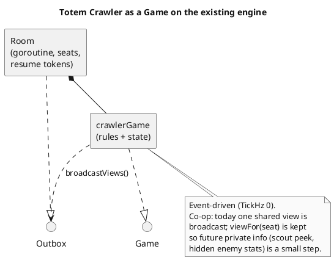
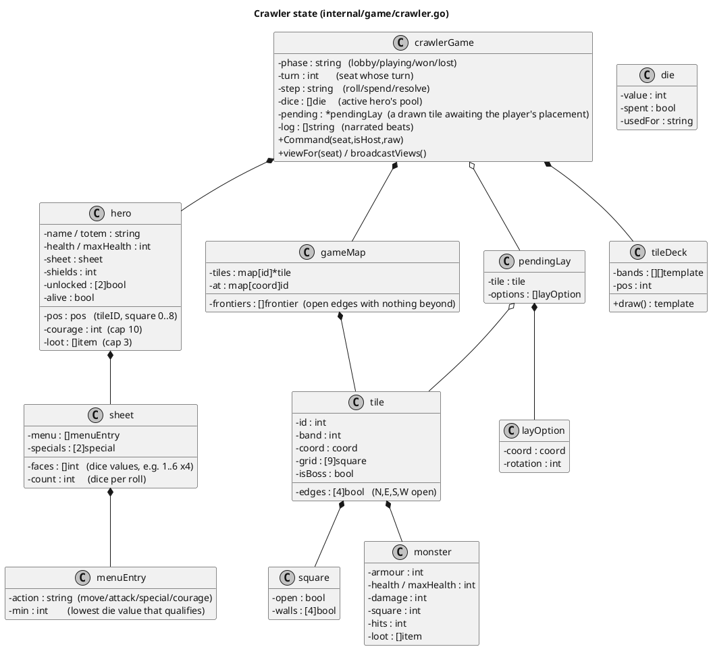
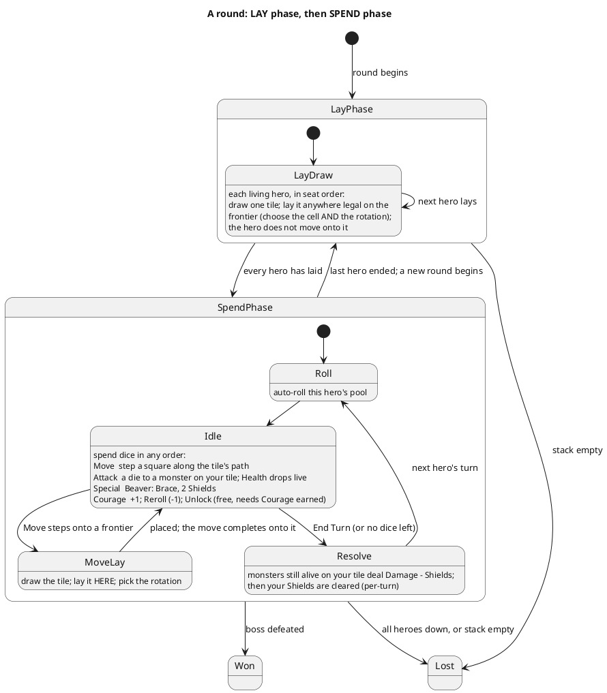
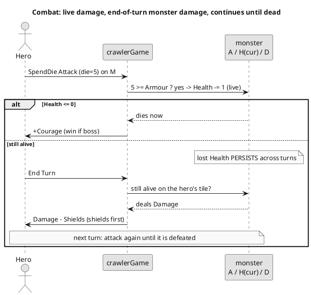
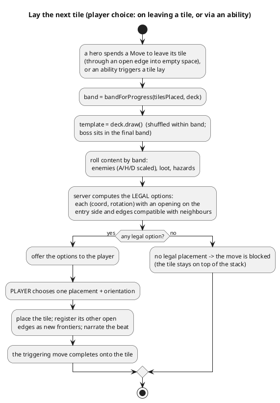

```table-of-contents
```

# Totem Crawler: architecture & V0 spec

The technical spec for the original co-op dungeon crawler. The product brief (theme, inspirations, character fiction, task list) lives in the design note [[Totem App - Interactive Dungeon Crawler]]; this document is the locked architecture: the data model, the turn rules as code will enforce them, the random tile generator, the wire protocol, and the test plan. It is deliberately written before any code, so the hard decisions are settled on paper first. Numbers marked "tune" are placeholders to playtest, not architecture.

The crawler is one more `Game` on the existing multiplayer engine (see [[TotemApp-IT-Games]] for the engine). It is turn-based and co-op, so it reuses rooms, reconnection, the totem sprite atlas for hero avatars, and the `useRoom` client transport unchanged. Nothing about the netcode is new; what is new is a much larger game state and a richer turn.

> [!note] Status: V0 implemented (0.4.1)
> V0 is built and verified on DEV: `internal/game/crawler.go` and `src/web/src/games/crawler/CrawlerPage.tsx`. The V0 simplifications flagged below are the ones that actually shipped (no fine inner tile walls, one monster per monster-tile on the centre square, no loot items or hazards yet, single-hero combat). Movement is **path-constrained**: a hero may only stand on the centre square and the doorway of each open edge (the four corners are off-path), so a straight is a corridor and a bend turns, without needing a full inner-wall model. This document stays the spec; the [0.4.1 changelog](../README.md#changelog) records the implementation.

## UML notation

Every diagram is PlantUML, rendered inline by Obsidian, forced monochrome on a white canvas so it stays readable in any theme. Four kinds are used: a **class diagram** for the Go state model, a **state diagram** for one hero's turn, an **activity diagram** for the tile generator, and a **sequence diagram** for combat. Arrows read as in the engine doc: `A ..|> B` "A implements B", `A *-- B` "A owns a B", `A o-- B` "A holds Bs".

## Scope: what V0 builds

V0 is the first playable build this spec defines. It is a full vertical slice of the real game, not a throwaway, and it includes the random tile generator (the choice made at kickoff).

**In V0**

- A new `crawlerGame` on the engine (slug `crawler`), event-driven (`TickHz 0`), co-op, 1 to 6 heroes, one hero per seat.
- **A round has two phases, each sweeping the party once in seat order.** First the **LAY phase**: every living hero draws one tile and lays it (see below), extending the map before anyone acts. Then the **SPEND phase**: each hero rolls a dice pool and spends each die through the sheet's action menu (Move, Attack, Special, Courage; reroll a die for 1 Courage), then ends their turn. After the last hero spends, a new round opens again at the LAY phase.
- Movement square by square across a 3x3 tile grid, constrained to the tile's path (centre plus the doorway of each open edge; corners are off-path).
- **Tiles are laid two ways.** In the LAY phase the lay is **proactive and mandatory**, and the player chooses **both the cell and the rotation**: the server offers every legal placement of the drawn tile across the whole frontier (any cell, any rotation that fits its neighbours and joins the map), the hero drags it where its doorways line up, and the hero does **not** move onto it. Because any frontier is in play, a hero whose own tile is fully surrounded still gets to lay elsewhere. In the SPEND phase the lay is **move-triggered** and **rotation only**: stepping out of your tile onto an empty frontier draws the next tile, lays it **at that frontier** (the location is fixed by where you stepped), you pick the rotation, and the move completes onto the new tile. A move onto an empty frontier with no legal placement is blocked.
- Random tile generation from a banded stack (easy early, nasty late) with named tile types (straight, bend, tee, cross, dead-end) and the boss shuffled into the final band. Tiles lay on all four sides, and an offered orientation always opens on the side you entered from, so the path always **connects** (you can never lay a tile whose path does not join the one you came from).
- Combat against static enemies (Armour / Health / Damage): hits land live, a monster's lost Health **persists across turns** so combat continues until it is defeated, and **every monster still alive on your tile deals its Damage (minus Shields) when you end your turn on it**, whether or not you attacked it.
- Courage economy (earn on high dice and on kills, spend on rerolls) and Shields. **Shields are a per-turn resource**: they do not stack across turns (cleared at end of turn; Thick Hide re-grants its 2 next turn). Unlocking the two specials costs no Courage but **requires** having earned it (3 then 5); the second needs the first.
- The **Beaver** fully specced (Brace, Thick Hide, Bulwark); every other player joins as a generic totem on the default menu.
- Win (boss defeated) and lose (party wiped, or the stack runs out before the boss falls), plus a per-tile narrated beat.
- Client: heroes are drawn from the **Bomberman totem sprite atlas** (not emoji), the player's **character sheet** sits at the top (sprite, health bar, resources, the action menu and the two specials), and hovering a monster shows its stats.
- A seeded RNG so a whole run reproduces, and a first-class test suite.

**Deferred (V1 and later)**

- Group fights (allies contributing reaction dice on another hero's turn, an interrupt mechanic).
- The other friends' totems as distinct sheets, loot items and a shop, active hazards, carry-an-ally and scout abilities.
- Hidden enemy stats (the Wavelength-style reveal), richer story beats, boss mechanics, balancing pass, mobile polish.

## Why it fits the engine as-is



The crawler implements the same `Game` interface as the card games: `AddPlayer` seats a hero, `Command` applies a client frame, `viewFor(seat)` renders the view and `broadcastViews()` pushes it on every change, `TickHz()` returns 0. Because the game is co-op with no hidden information in V0, `viewFor` returns the same view for everyone, but the per-seat path is kept so a later private ability does not force a redesign.

## Core data model



A `pos` is a tile id plus a square index 0..8 (row-major over the 3x3). An `edge` direction is 0..3 for N,E,S,W; `walls` on a square are the four inner sides blocked within its tile. A `coord` is the tile's integer `(x,y)` on the abstract map grid.

## Assets and sprites (where art lives)

Game art is **not** in the database. The data model above is pure game state (and the DB schema in the main [README](../README.md#data-model) is the animal catalogue); sprites and other art are **static files** served by the SPA. The flow is the same one Bomberman already uses: a file under `src/web/public/` is copied verbatim by Vite into `src/web/dist/`, which `totemd` serves at the root path and, in production, embeds into the single binary via `embed.FS`. No API call, no DB row, no server round-trip to fetch art.

| Asset | Where it lives | Served at | Notes |
| --- | --- | --- | --- |
| **Hero totems** (in use) | `src/web/public/sprites/totems.{png,json}` | `/sprites/totems.png` | The shared atlas, one row per animal (see the main README's [Totem sprites](../README.md#totem-sprites)). The crawler draws each hero's **front frame** (column 0 of its row) via a CSS background, reusing the Bomberman art with no extra fetch. `SPRITE_ROWS` in `CrawlerPage.tsx` holds the row order. |
| **Map tiles** (in use, 0.4.4) | `src/web/public/sprites/crawler/tiles/tile-<i>.png` | `/sprites/crawler/tiles/*` | Split from a grid sheet by [`scripts/make_tiles.py`](../scripts/make_tiles.py). The client maps each engine tile `kind` to a file and rotates it to the laid orientation (`TILE_ART` in `CrawlerPage.tsx`). |
| **Enemies** (in use, 0.4.7+) | `src/web/public/sprites/crawler/enemies/<slug>/<pose>.png` | `/sprites/crawler/enemies/*` | Split from a sheet by [`scripts/make_enemies.py`](../scripts/make_enemies.py) (flat background stripped). Each monster carries a `kind` on the wire; the client maps it to a sprite (`MonsterSprite`): the weak **drone** and the tougher **brute**, each drawing its `idle` frame, or its `attack` frame plus a lunge while **engaged** (you are fighting it this turn). The boss is still 💀; loot art is not wired yet. |

**How map tiles are loaded.** Unlike the totem atlas, tiles are kept as **individual PNGs** (not one atlas): the client rotates each tile independently to the orientation it was laid in, and rotating a shared atlas viewport would rotate its neighbours too. The pipeline:

1. `scripts/make_tiles.py SHEET --rows R --cols C` splits a grid sheet into `tile-<i>.png` (reading order) under `sprites/crawler/tiles/`, plus a `tiles.json` manifest. It is the tile counterpart of `make_sprites.py`.
2. `TILE_ART` in `CrawlerPage.tsx` maps each engine `kind` to a file and the open **edges as drawn** (N,E,S,W). On render, `tileArt(kind, edges)` finds the rotation (0/90/180/270) where `rotateEdges(base, r)` equals the tile's actual edges and applies it, so the drawn doorways line up with the real connectivity. The art sits in a layer **behind** the pawn/monster grid (`.cr-tile-art`, `z-index 0`) so pieces stay upright over a rotated tile.
3. A kind with no entry falls back to the styled cell, which still shows the gold doorways and the type label, so connectivity is never ambiguous. Adding art later is a one-line `TILE_ART` edit, no protocol change (`kind` and `edges` are already on the wire).

**Where the tile data lives (to check or correct it):** the `TILE_ART` table at the top of `CrawlerPage.tsx`. Each entry is `kind: { file, base }`, where `base` is the open edges **[N, E, S, W] as the art is drawn**. If a tile looks mislabelled or its path does not line up, fix its `base` (or point it at a different `tile-<i>.png`) there; nothing else needs to change. The current map is **straight → tile-1, bend → tile-2, T-junction → tile-3, crossroads → tile-4, dead-end → tile-0, boss → tile-7** (the stairs lair). The **gate** variant (tile-6) is left out for now. Because the server sends each tile's chosen `rot`, `tileArt` can rotate even a fully symmetric tile (the crossroads) for variety while still lining asymmetric tiles up with their real edges.

The boss only ever appears in the **final band** of the stack (`buildDeck`, asserted over 40 seeds by `TestCrawlerBossInFinalBand`); a regular monster is never a boss.

Two notes for generating more tile art: it must read for all four **rotations** (the engine rotates the base when laid), and the open **edges** (`tile.edges`) are what line up with neighbours, so the doorways in the art sit at the mid-point of each side (the `crawlerDoor` squares). A tile whose path connects two **adjacent** sides is a bend; one with a single doorway is a dead-end.

**Laying a tile (client).** Both lays send the legal `(coord, rotation)` options in `pending` with a `phaseLay` flag. The client shows the drawn tile as a card with its art, lights every option cell on the board as a pulsing **drop-zone** with a ghost of the tile, and the player **rotates** through the orientations and drops (or clicks) the cell to commit (`layTile`); a chosen rotation is kept across cells, falling back to a cell's own legal rotation only where it does not fit. The `phaseLay` flag drives this: a proactive LAY-phase lay spans the **whole frontier** (many cells, you choose where and how), while a move-triggered lay is a **single cell** (fixed by where you stepped) and only its rotations, so the copy reads "any glowing cell, you move on your turn" versus "the spot is fixed, click to step through". The board is a scroll box that keeps your tile (for a proactive lay) or the stepped-onto cell (for a move lay) centred, so a growing map scrolls rather than shrinking.

## The action menu (the core innovation, as code)

The design's die map resolves to one rule: **each action has a minimum die value, and a die can pay for any action whose minimum it meets.** "You can go down" is exactly this (a high die can do a low action); you can never go up (a 1 cannot Attack). The default menu:

| Action | Min die | Effect |
| --- | --- | --- |
| Move | 1 | step one square (a fast totem steps two per die) |
| Special | 2 | the sheet's signature (Beaver: Brace, 2 Shields to self or an ally on the tile) |
| Attack | 4 | assign the die to a monster on your tile; a hit if value >= its Armour |
| Courage | 5 | +1 Courage (cap 10) |

So a 6 may Move, Special, Attack or Courage; a 4 may Move, Special or Attack; a 1 may only Move. The sheet owns the thresholds, so a totem can deviate (the menu is data, not hard-coded). This is the "every number is useful" promise made mechanical: there is no dead die, only a choice.

## A round: lay phase, then spend phase



A round always lays before it plays. In the **LAY phase** every living hero draws one tile, mandatory, and lays it anywhere legal on the frontier: the server offers every cell and rotation where the drawn tile both fits its neighbours (`edgesFit`) and joins the map on at least one open side (`connects`), and the hero drags it to the spot where the doorways line up. The hero does not move onto it. Because the whole frontier is in play rather than only the cells next to the hero, a hero whose own tile is boxed in still lays elsewhere; a hero is skipped only when nothing fits anywhere. Then the **SPEND phase** gives each hero a dice turn. Dice are rolled once at the start of your turn and spent in any order. Each Attack die is applied **immediately** and the monster's Health drops live; a lethal blow kills it at once. **A monster's lost Health persists across turns**, so a tough enemy is whittled down over several turns: combat continues until it is defeated. At the **end of your turn, every monster still alive on your tile deals its Damage (minus your Shields) to you**, whether or not you attacked it this turn: standing on a monster's square is dangerous until it is dead. Moving onto an empty frontier mid-turn lays a tile there too (the move-triggered lay), with the same rotation-only choice. Combat in V0 is the active hero alone; allies pooling dice (a group fight) is the first V1 feature, since it needs a cross-turn interrupt.

Mandatory laying makes the stack drain faster (every hero spends one tile per round before any move-triggered draws), which shortens a run and brings the boss band sooner; `perBand` and `bands` in `buildDeck` are the knobs to retune the run length against the party size if playtests want it longer.

## Combat



A monster shows Armour (minimum die to land a hit), Health (hits to kill, tracked as a current value that drops live and persists), and Damage (dealt back if it survives). Heroes have no damage stat: output is purely how many Attack dice land, as in Explorers. Shields are consumed one per point of incoming Damage before it reaches Health. Worked example from the brief, which is a test: a Gor is A4 H2 D3; Attack dice 5, 4 land two hits (5 and 4 beat 4), dropping Health to 0, so it dies at once and deals nothing; had only the 5 landed, it survives on 1 Health (kept for next turn) and deals 3 minus Shields at end of turn. Hovering a monster on the board shows its Armour, current Health and Damage.

## Tiles: random generation and placement

Tiles are generated in code from a pool of hand-designed **templates** (interior wall layout plus which edges are open), drawn from a banded stack, rotated to fit, then populated with content rolled by band. This hybrid was chosen over pure procedural interiors because templates guarantee every tile is connected and playable and keep the board-game "deck of tiles" feel, while the per-tile content roll and rotation still give a different map every run. Pure procedural generation stays an option if templates feel too samey.

The V0 tile types (named shapes, by their open edges; rotations cover every orientation, so any type can be laid on any of the four sides):

| Type | Open edges | Role |
| --- | --- | --- |
| **straight** | two opposite (a corridor) | links two directions |
| **bend** | two adjacent (a corner) | turns the path |
| **tee** | three | a junction, branches the map |
| **cross** | all four | an open crossroads (the start tile) |
| **dead-end** | one | caps a branch |
| **boss** | one (a lair) | the boss room, in the final band |

The draw pool is weighted: corridors and bends common, junctions a little rarer, dead-ends rare. The start tile is a cross, so from the very first turn the party can explore (and the map can grow) in all four directions.



The map is a graph of tiles on an integer grid; each tile has up to four open edges. A **frontier** is an open edge with no tile beyond it yet. Tiles are **laid by moving**: when a hero steps out of its tile onto a frontier, the next tile is drawn and laid **at that frontier** (the location is fixed by the step), and the server offers the rotations that fit there. The player picks only the orientation, so the decision is which way the corridors face, not where the tile goes; the move then completes onto the new tile. The stack is ordered in difficulty bands (easy early, nasty late), shuffled within each band; the single boss template is shuffled into the final band at a random position among its last few, so the stack running low is the only warning that the boss is near. Running the stack dry without beating the boss is a loss: you were too slow.

The invariant the server never breaks when it offers orientations: every one **opens on the entry side** (so the hero can step in) and **matches** any already-placed neighbour (no open edge facing a wall, no wall facing a path). Because you entered through an open doorway, the entry-side opening guarantees the path **connects**: the map stays one connected network and you can never lay a tile whose path does not join the one you came from. The player chooses only among those legal orientations; the server rejects anything else. A test asserts the invariant across many seeds, and that the boss always lands in the final band.

## Characters and sheets

A totem is defined entirely by its sheet: dice (count and face values), the action menu (thresholds), two Courage-unlocked specials, health, and Courage gain or cap. No per-character world gimmicks; identity lives in these levers, which keeps the game light and the engine generic. The sheet is data, so adding a friend's totem in V1 is a data entry plus, at most, one new special effect, not new engine code.

**Beaver (fully specced for V0).** Health 7 (roster baseline is 5). Four plain d6. Menu: Move>=1, Brace (Special)>=2 for 2 Shields to self or an ally on the tile, Attack>=4, Courage>=5. First special Thick Hide (unlock needs 3 Courage earned, not spent): start every turn with 2 Shields on yourself (and since Shields are per-turn, this is 2 fresh each turn, not a growing stack). Second special Bulwark (unlock needs 5 Courage earned, and Thick Hide first): when allies on your tile would take Damage, you may take all of it instead, reduced by your Shields first. His low dice become Shields, so no roll is wasted; the balance lever if he tests too strong is to narrow Attack to >=5, leaving the Shield engine, which is his identity, alone. (In the shipped V0 only Thick Hide is wired to an effect; Bulwark and the generic specials are unlock-flagged but inert until V1.)

**Generic totem (every other seat in V0).** Health 5, four plain d6, the default menu with a plain Special (tune: a small self-buff), no distinct specials until its real sheet arrives in V1.

## Networking: commands and views

The wire frames are the engine's usual four (`welcome`, `roster`, `state`, `error`); only the command types and the `state` view shape are the crawler's own. The game is co-op, so the `state` view is the full shared picture in V0.

**Commands (client to server), all validated server-side on the owner's turn**

| `t` | Payload | Rule |
| --- | --- | --- |
| `start` | | host only, from lobby, 1 to 6 seated |
| `spend` | `die`, `action`, `target` | your turn, spend step; `target` is a direction (Move), a monster id (Attack), or a seat (Brace). A Move onto a frontier draws a tile and pauses to lay it (`layTile`) |
| `layTile` | `coord`, `rotation` | your turn, lay step; must be one of the offered orientations at the frontier. The move then completes onto the new tile |
| `reroll` | `die` | costs 1 Courage |
| `unlock` | `which` (0 or 1) | no Courage cost, but requires 3 (then 5) Courage earned; the second needs the first |
| `endTurn` | | applies monster damage on your tile, clears your (per-turn) Shields, then advances to the next hero |
| `restart` | | host only, from won or lost |

**View (`state`) fields**: `phase`, `turn`, `step`, the active hero's `dice` (value, spent, usedFor), any `pending` tile lay (the drawn tile plus the list of legal `(coord, rotation)` options for the client to render as choices), every `hero` (totem, health, pos, courage, shields, loot, unlocked, alive), the `map` (placed tiles with their 3x3 grids, edges, enemies with A/H/D and remaining Health, loot and hazard squares), the `frontiers`, the `deck` count with the current band and a `bossNear` flag once the final band is reached, the recent `log` beats, and `won` / `lost`. Every slice is built with `append([]T{}, ...)` so none serialises as `null` (the engine's standing rule).

## Testing strategy

Testing is first-class and written alongside the logic, driving `Command` through a `fakeOutbox` as the other games do, with a seeded RNG so runs reproduce.

- **Action menu**: a 4 can Move or Attack but not Courage; a 1 can only Move; a 5 can Attack or Courage; Brace is available on a 2.
- **Combat**: the Gor example both ways (kill with 5+4; survive and deal 3 on only the 5); hits count correctly at the Armour boundary; Shields absorb Damage before Health; a kill grants +1 Courage and the monster's loot.
- **Courage economy**: earned on a spent 5 or 6 and on a kill, capped at 10; a reroll costs 1; the two specials unlock for free, the second gated behind the first.
- **Shields**: block one Damage each; Brace grants two to the chosen target. They are a **per-turn** resource, cleared at the end of your turn so they do not stack across turns (Thick Hide simply re-grants its 2 at the start of your next turn).
- **Movement**: one square per Move die (two for a fast totem), inner walls and closed edges block it, and a Move that leaves the tile draws exactly one tile and sets a pending lay.
- **Tile laying**: the server offers at least one legal option whenever a legal placement exists; every offered `(coord, rotation)` has an opening on the entry side and matches its neighbours; `layTile` accepts only an offered option and rejects anything else; the deck drains in band order; the boss always lands in the final band.
- **Win and lose**: defeating the boss wins; all heroes down loses; draining the stack before the boss falls loses.
- **Determinism**: a fixed seed reproduces a whole run (same rolls, same tiles, same placements).

## Roadmap

- **V0** (this spec): engine `Game`, random banded tile generation with edge-matching and the boss in the final band, the full core turn (dice, menu, Move, Attack, Special, Courage, reroll), Shields, the Beaver plus a generic totem, win and lose, narrated beats, and the test suite.
- **V1**: group fights (the allies-join interrupt), the friends' totems as distinct sheets, loot items and a shop, active hazards, and the carry and scout abilities.
- **V2**: hidden enemy stats, richer per-tile story beats, boss mechanics, and a balancing pass once it is played with real people.
- **V3**: mobile layout and art polish.

## Open numbers to tune (not architecture)

Courage gain per high die and per kill, the Courage cap, hero health values, dice distributions for non-Beaver totems, monster A/H/D per band, the number and size of difficulty bands, the boss window within the final band, loot drop rates, and party-wipe versus single-death loss. All of these are data or constants; none changes the model above.
