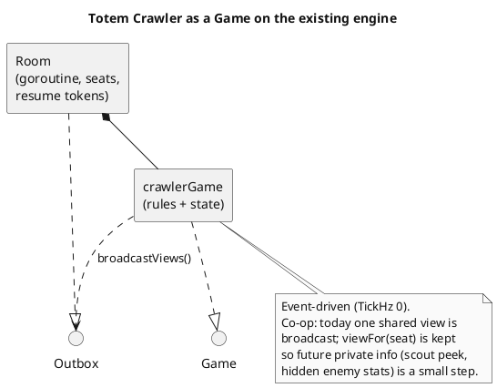
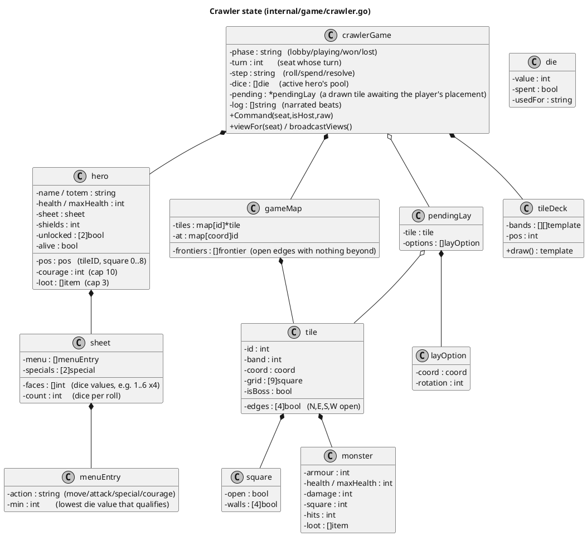
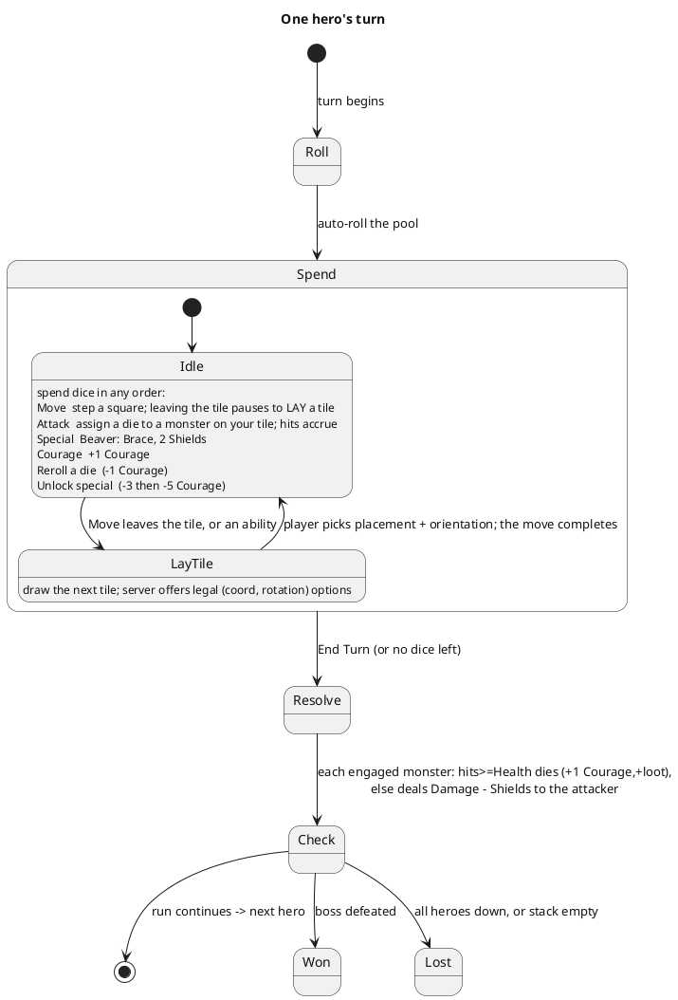
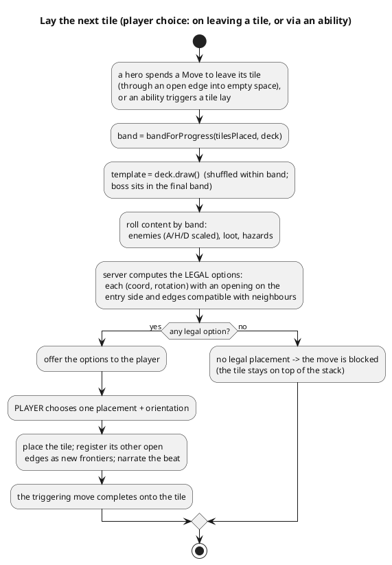

```table-of-contents
```

# Totem Crawler: architecture & V0 spec

The technical spec for the original co-op dungeon crawler. The product brief (theme, inspirations, character fiction, task list) lives in the design note [[Totem App - Interactive Dungeon Crawler]]; this document is the locked architecture: the data model, the turn rules as code will enforce them, the random tile generator, the wire protocol, and the test plan. It is deliberately written before any code, so the hard decisions are settled on paper first. Numbers marked "tune" are placeholders to playtest, not architecture.

The crawler is one more `Game` on the existing multiplayer engine (see [[TotemApp-IT-Games]] for the engine). It is turn-based and co-op, so it reuses rooms, reconnection, the totem sprite atlas for hero avatars, and the `useRoom` client transport unchanged. Nothing about the netcode is new; what is new is a much larger game state and a richer turn.

> [!note] Status: V0 implemented (0.4.1)
> V0 is built and verified on DEV: `internal/game/crawler.go` (11 tests) and `src/web/src/games/crawler/CrawlerPage.tsx`. The V0 simplifications flagged below are the ones that actually shipped (no inner tile walls, one monster per monster-tile on the centre square, no loot items or hazards yet, single-hero combat). This document stays the spec; the [0.4.1 changelog](../README.md#changelog) records the implementation.

## UML notation

Every diagram is PlantUML, rendered inline by Obsidian, forced monochrome on a white canvas so it stays readable in any theme. Four kinds are used: a **class diagram** for the Go state model, a **state diagram** for one hero's turn, an **activity diagram** for the tile generator, and a **sequence diagram** for combat. Arrows read as in the engine doc: `A ..|> B` "A implements B", `A *-- B` "A owns a B", `A o-- B` "A holds Bs".

## Scope: what V0 builds

V0 is the first playable build this spec defines. It is a full vertical slice of the real game, not a throwaway, and it includes the random tile generator (the choice made at kickoff).

**In V0**

- A new `crawlerGame` on the engine (slug `crawler`), event-driven (`TickHz 0`), co-op, 1 to 6 heroes, one hero per seat.
- The core turn: roll your dice pool, spend each die through your sheet's action menu (Move, Attack, Special, Courage), reroll a die for 1 Courage.
- Movement square by square across a 3x3 tile grid, respecting inner walls and tile edges.
- **The player lays tiles**: when a hero is about to leave its tile (spend a Move through an open edge into empty space), or when an ability allows it, the player draws the next tile and chooses its placement and orientation from the legal options the server offers (often several).
- Random tile generation from a banded stack (easy early, nasty late) with named tile types (straight, bend, tee, cross, dead-end) and the boss shuffled into the final band. Tiles lay on all four sides.
- Combat against static enemies (Armour / Health / Damage): hits land live, a monster's lost Health **persists across turns** so combat continues until it is defeated, and a monster you fought but did not kill retaliates once at end of turn.
- Courage economy (earn on high dice and on kills, spend on rerolls and on unlocking two specials) and Shields.
- The **Beaver** fully specced (Brace, Thick Hide, Bulwark); every other player joins as a generic totem on the default menu.
- Win (boss defeated) and lose (party wiped, or the stack runs out before the boss falls), plus a per-tile narrated beat.
- Client: heroes are drawn from the **Bomberman totem sprite atlas** (not emoji), the player's **character sheet** sits at the top (sprite, health bar, resources, the action menu and the two specials), and hovering a monster shows its stats.
- A seeded RNG so a whole run reproduces, and a first-class test suite.

**Deferred (V1 and later)**

- Group fights (allies contributing reaction dice on another hero's turn, an interrupt mechanic).
- The other friends' totems as distinct sheets, loot items and a shop, active hazards, carry-an-ally and scout abilities.
- Hidden enemy stats (the Wavelength-style reveal), richer story beats, boss mechanics, balancing pass, mobile polish.

## Why it fits the engine as-is



The crawler implements the same `Game` interface as the card games: `AddPlayer` seats a hero, `Command` applies a client frame, `viewFor(seat)` renders the view and `broadcastViews()` pushes it on every change, `TickHz()` returns 0. Because the game is co-op with no hidden information in V0, `viewFor` returns the same view for everyone, but the per-seat path is kept so a later private ability does not force a redesign.

## Core data model



A `pos` is a tile id plus a square index 0..8 (row-major over the 3x3). An `edge` direction is 0..3 for N,E,S,W; `walls` on a square are the four inner sides blocked within its tile. A `coord` is the tile's integer `(x,y)` on the abstract map grid.

## Assets and sprites (where art lives)

Game art is **not** in the database. The data model above is pure game state (and the DB schema in the main [README](../README.md#data-model) is the animal catalogue); sprites and other art are **static files** served by the SPA. The flow is the same one Bomberman already uses: a file under `src/web/public/` is copied verbatim by Vite into `src/web/dist/`, which `totemd` serves at the root path and, in production, embeds into the single binary via `embed.FS`. No API call, no DB row, no server round-trip to fetch art.

| Asset | Where it lives | Served at | Notes |
| --- | --- | --- | --- |
| **Hero totems** (in use) | `src/web/public/sprites/totems.{png,json}` | `/sprites/totems.png` | The shared atlas, one row per animal (see the main README's [Totem sprites](../README.md#totem-sprites)). The crawler draws each hero's **front frame** (column 0 of its row) via a CSS background, reusing the Bomberman art with no extra fetch. `SPRITE_ROWS` in `CrawlerPage.tsx` holds the row order. |
| **Crawler art** (incoming) | `src/web/public/sprites/crawler/` (proposed) | `/sprites/crawler/*` | New folder for crawler-specific art: tiles (straight/bend/tee/cross/dead-end/boss), monsters, the boss, and later loot/items. |

**Convention for the new crawler art.** Mirror the totem atlas: one PNG per family plus a small JSON frame map (name -> `{x,y,w,h}`), for example `tiles.{png,json}` and `monsters.{png,json}` under `sprites/crawler/`. Keeping frames in an atlas means one request per family, the map is hand-editable, and `scripts/make_sprites.py` can emit it the same way it does for totems. Reference art by its key, never by a hard-coded pixel offset, so re-generating the atlas never touches the client. Until the art exists the client falls back to what it draws today: the totem sprite for heroes, emoji (👹 / 💀) for monsters, and the CSS tile cell with its type label for tiles. **Tile `kind` and monster stats are already on the wire**, so wiring art in later is a render change only, not a protocol change.

Two practical notes for generating tiles specifically: a tile's art must read correctly for all four **rotations** (the engine rotates the base shape when it is laid), so either draw one orientation and let CSS rotate it, or supply all four; and the open **edges** (`tile.edges`, N/E/S/W) are what must line up with neighbours, so the doorways in the art need to sit at the mid-point of each side to match the `crawlerDoor` squares.

## The action menu (the core innovation, as code)

The design's die map resolves to one rule: **each action has a minimum die value, and a die can pay for any action whose minimum it meets.** "You can go down" is exactly this (a high die can do a low action); you can never go up (a 1 cannot Attack). The default menu:

| Action | Min die | Effect |
| --- | --- | --- |
| Move | 1 | step one square (a fast totem steps two per die) |
| Special | 2 | the sheet's signature (Beaver: Brace, 2 Shields to self or an ally on the tile) |
| Attack | 4 | assign the die to a monster on your tile; a hit if value >= its Armour |
| Courage | 5 | +1 Courage (cap 10) |

So a 6 may Move, Special, Attack or Courage; a 4 may Move, Special or Attack; a 1 may only Move. The sheet owns the thresholds, so a totem can deviate (the menu is data, not hard-coded). This is the "every number is useful" promise made mechanical: there is no dead die, only a choice.

## One hero's turn



Dice are rolled once at the start of your turn. You spend them in any order. Each Attack die is applied **immediately** and the monster's Health is reduced live; a lethal blow kills it at once. **A monster's lost Health persists across turns**, so a tough enemy is whittled down over several turns: combat continues until it is defeated. A monster you attacked but did not kill retaliates **once at the end of that turn** (so it strikes back each turn you fight it). Combat in V0 is the active hero alone; allies pooling dice (a group fight) is the first V1 feature, since it needs a cross-turn interrupt.

## Combat


A monster shows Armour (minimum die to land a hit), Health (hits to kill, tracked as a current value that drops live and persists), and Damage (dealt back if it survives). Heroes have no damage stat: output is purely how many Attack dice land, as in Explorers. Shields are consumed one per point of incoming Damage before it reaches Health. Worked example from the brief, which is a test: a Gor is A4 H2 D3; Attack dice 5, 4 land two hits (5 and 4 beat 4), dropping Health to 0, so it dies at once and deals nothing; had only the 5 landed, it survives on 1 Health (kept for next turn) and deals 3 minus Shields at end of turn. Hovering a monster on the board shows its Armour, current Health and Damage.

## Tiles: random generation and placement

Tiles are generated in code from a pool of hand-designed **templates** (interior wall layout plus which edges are open), drawn from a banded stack, rotated to fit, then populated with content rolled by band. This hybrid was chosen over pure procedural interiors because templates guarantee every tile is connected and playable and keep the board-game "deck of tiles" feel, while the per-tile content roll and rotation still give a different map every run. Pure procedural generation stays an option if templates feel too samey.

The V0 tile types (named shapes, by their open edges; rotations cover every orientation, so any type can be laid on any of the four sides):

| Type | Open edges | Role |
| --- | --- | --- |
| **straight** | two opposite (a corridor) | links two directions |
| **bend** | two adjacent (a corner) | turns the path |
| **tee** | three | a junction, branches the map |
| **cross** | all four | an open crossroads (the start tile) |
| **dead-end** | one | caps a branch |
| **boss** | one (a lair) | the boss room, in the final band |

The draw pool is weighted: corridors and bends common, junctions a little rarer, dead-ends rare. The start tile is a cross, so from the very first turn the party can explore (and the map can grow) in all four directions.



The map is a graph of tiles on an integer grid; each tile has up to four open edges. A **frontier** is an open edge with no tile beyond it yet. Tiles are **laid by the player, not placed automatically**: when a hero is about to leave its tile (spends a Move through an open edge into empty space), the next tile is drawn and the player chooses how to lay it, and an ability may also let a player draw and lay a tile. The server computes the legal options (each a coordinate and a rotation) and the player picks one; there are often several, which is a real decision (which way the corridors face, which neighbour to connect when more than one frontier is in play). The stack is ordered in difficulty bands (easy early, nasty late), shuffled within each band; the single boss template is shuffled into the final band at a random position among its last few, so the stack running low is the only warning that the boss is near. Running the stack dry without beating the boss is a loss: you were too slow.

Edge matching is the one invariant the server must never break when it offers options: every option it presents has an open edge on the entry side (so you can always walk in) and is compatible with any already-placed neighbours (no open edge facing a wall, no wall facing an open edge). The player chooses only among those legal options; the server rejects anything else. A test asserts that every offered option satisfies the invariant across many seeds, and that the boss always lands in the final band.

## Characters and sheets

A totem is defined entirely by its sheet: dice (count and face values), the action menu (thresholds), two Courage-unlocked specials, health, and Courage gain or cap. No per-character world gimmicks; identity lives in these levers, which keeps the game light and the engine generic. The sheet is data, so adding a friend's totem in V1 is a data entry plus, at most, one new special effect, not new engine code.

**Beaver (fully specced for V0).** Health 7 (roster baseline is 5). Four plain d6. Menu: Move>=1, Brace (Special)>=2 for 2 Shields to self or an ally on the tile, Attack>=4, Courage>=5. First special Thick Hide (3 Courage): start every turn with 2 Shields on yourself. Second special Bulwark (5 more Courage): when allies on your tile would take Damage, you may take all of it instead, reduced by your Shields first. His low dice become Shields, so no roll is wasted; the balance lever if he tests too strong is to narrow Attack to >=5, leaving the Shield engine, which is his identity, alone.

**Generic totem (every other seat in V0).** Health 5, four plain d6, the default menu with a plain Special (tune: a small self-buff), no distinct specials until its real sheet arrives in V1.

## Networking: commands and views

The wire frames are the engine's usual four (`welcome`, `roster`, `state`, `error`); only the command types and the `state` view shape are the crawler's own. The game is co-op, so the `state` view is the full shared picture in V0.

**Commands (client to server), all validated server-side on the owner's turn**

| `t` | Payload | Rule |
| --- | --- | --- |
| `start` | | host only, from lobby, 1 to 6 seated |
| `spend` | `die`, `action`, `target` | your turn, Spend step; `target` is a square (Move), a monster id (Attack), or a seat (Brace). A Move that leaves the tile draws a tile and sets `pending` (see `layTile`) |
| `layTile` | `coord`, `rotation` | resolves a `pending` lay; must be one of the offered options; then the triggering Move completes onto the new tile |
| `reroll` | `die` | costs 1 Courage |
| `unlock` | `which` (0 or 1) | costs 3 then 5 Courage; marks the special usable |
| `endTurn` | | resolves engaged monsters, then advances |
| `restart` | | host only, from won or lost |

**View (`state`) fields**: `phase`, `turn`, `step`, the active hero's `dice` (value, spent, usedFor), any `pending` tile lay (the drawn tile plus the list of legal `(coord, rotation)` options for the client to render as choices), every `hero` (totem, health, pos, courage, shields, loot, unlocked, alive), the `map` (placed tiles with their 3x3 grids, edges, enemies with A/H/D and remaining Health, loot and hazard squares), the `frontiers`, the `deck` count with the current band and a `bossNear` flag once the final band is reached, the recent `log` beats, and `won` / `lost`. Every slice is built with `append([]T{}, ...)` so none serialises as `null` (the engine's standing rule).

## Testing strategy

Testing is first-class and written alongside the logic, driving `Command` through a `fakeOutbox` as the other games do, with a seeded RNG so runs reproduce.

- **Action menu**: a 4 can Move or Attack but not Courage; a 1 can only Move; a 5 can Attack or Courage; Brace is available on a 2.
- **Combat**: the Gor example both ways (kill with 5+4; survive and deal 3 on only the 5); hits count correctly at the Armour boundary; Shields absorb Damage before Health; a kill grants +1 Courage and the monster's loot.
- **Courage economy**: earned on a spent 5 or 6 and on a kill, capped at 10; a reroll costs 1; the two unlocks cost 3 then 5 and gate their special.
- **Shields**: block one Damage each, persist across rounds, Brace grants two to the chosen target.
- **Movement**: one square per Move die (two for a fast totem), inner walls and closed edges block it, and a Move that leaves the tile draws exactly one tile and sets a pending lay.
- **Tile laying**: the server offers at least one legal option whenever a legal placement exists; every offered `(coord, rotation)` has an opening on the entry side and matches its neighbours; `layTile` accepts only an offered option and rejects anything else; the deck drains in band order; the boss always lands in the final band.
- **Win and lose**: defeating the boss wins; all heroes down loses; draining the stack before the boss falls loses.
- **Determinism**: a fixed seed reproduces a whole run (same rolls, same tiles, same placements).

## Roadmap

- **V0** (this spec): engine `Game`, random banded tile generation with edge-matching and the boss in the final band, the full core turn (dice, menu, Move, Attack, Special, Courage, reroll), Shields, the Beaver plus a generic totem, win and lose, narrated beats, and the test suite.
- **V1**: group fights (the allies-join interrupt), the friends' totems as distinct sheets, loot items and a shop, active hazards, and the carry and scout abilities.
- **V2**: hidden enemy stats, richer per-tile story beats, boss mechanics, and a balancing pass once it is played with real people.
- **V3**: mobile layout and art polish.

## Open numbers to tune (not architecture)

Courage gain per high die and per kill, the Courage cap, the two unlock costs, hero health values, dice distributions for non-Beaver totems, monster A/H/D per band, the number and size of difficulty bands, the boss window within the final band, loot drop rates, and party-wipe versus single-death loss. All of these are data or constants; none changes the model above.
