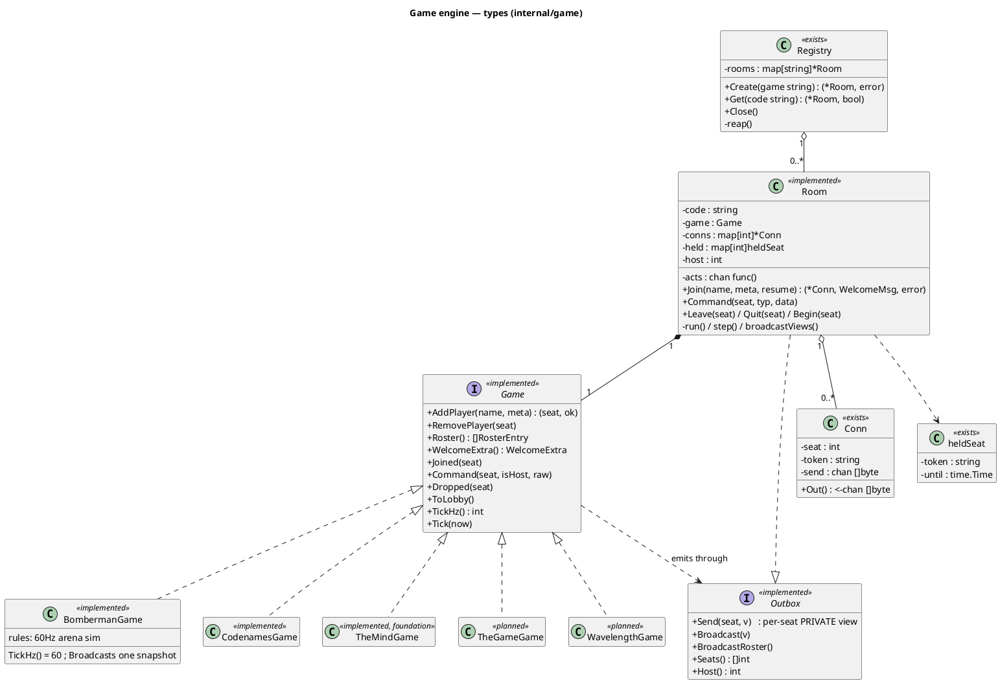
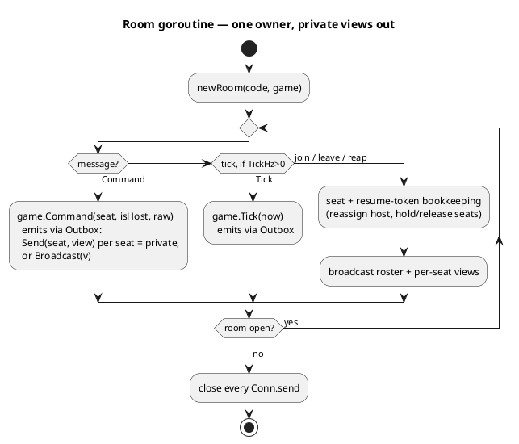
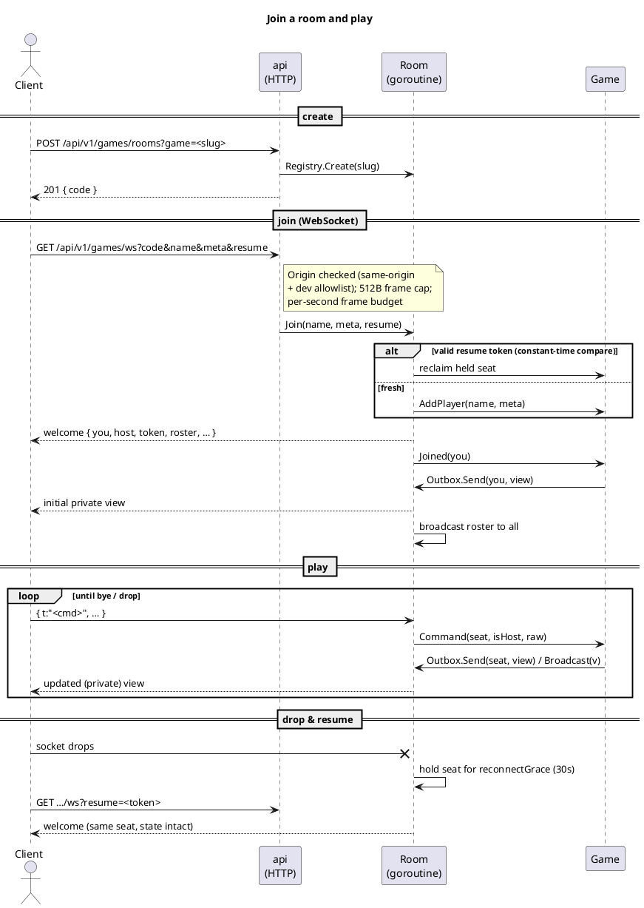
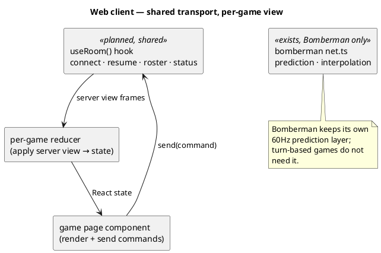

```table-of-contents
```

# Multiplayer games — engine architecture

How the realtime multiplayer layer is put together, and how a **new game** plugs
into it. The main [README](../README.md#games-multiplayer) covers Bomberman's
netcode (prediction, interpolation); this document is about the **shared engine**
underneath it and the seam every other game reuses.

Diagrams are PlantUML (rendered in Obsidian / any PlantUML viewer).

## The idea: one engine, many games

Everything that is *not* a game's rules is shared. A room is a code, a set of
seats, reconnect tokens, a per-client send queue, an origin-checked WebSocket and
a single goroutine that owns the state. Only the rules differ between games, so
those live behind one interface and the engine drives them.

The one capability these new games need that Bomberman never did is **per-seat
private views**: the Codenames spymaster sees the key and the guessers do not;
you see your own hand and everyone else sees its back. So the room does not
broadcast one state to all; it asks the game to render the view *each seat is
allowed to see* and sends each seat its own.

Legend in the diagrams below: **(exists)** ships today (Bomberman), **(planned)**
is the generalization being built.

## Package & type structure (Go)



**What each part owns**

| Part | Responsibility | Game-specific? |
| --- | --- | --- |
| `Registry` | room codes (crypto/rand, unguessable), capacity cap, idle reaping | no |
| `Room` | the single-goroutine loop, seats, reconnect/resume tokens, host, send queues, driving the `Game` | no |
| `Conn` | one client's seat + resume token + bounded drop-oldest send channel | no |
| `Game` | the rules: seating, commands, **per-seat view**, optional clock | **yes** |

`Registry`, `Room` and `Conn` already exist and are game-agnostic in spirit; the
refactor lifts Bomberman's `*Match` out of `Room` and behind `Game`, so
`BombermanGame` becomes the first implementation with no behaviour change.

## The `Game` interface

A game emits frames through the `Outbox` the room hands it, rather than returning
a view to the room. **The private-view primitive is `Outbox.Send(seat, v)`**: on a
change, a game typically loops `Outbox.Seats()` and sends each seat the output of
its own `renderFor(seat)` helper (what that seat may see). Bomberman instead calls
`Outbox.Broadcast` with one shared snapshot. Every method below runs on the room
goroutine, so a game needs no locks.

| Method | When the room calls it | Notes |
| --- | --- | --- |
| `AddPlayer(name, meta)` | on join (no resume) | `meta` is a free per-game string (totem slug, team choice, …); `ok=false` when full |
| `RemovePlayer(seat)` | when a held seat's grace lapses | |
| `Roster()` | the room builds a roster | slow-changing identities; the room folds in host + "gone" |
| `WelcomeExtra()` | on join | game-specific welcome fields (Bomberman: arena, fuse) |
| `Joined(seat)` | right after the welcome | push this seat its initial private view via `Outbox.Send` |
| `Command(seat, isHost, raw)` | on each client frame | the game parses `raw`; `isHost` gates host-only actions |
| `Dropped(seat)` | socket dropped, seat held | Bomberman freezes that player; turn games may ignore |
| `ToLobby()` | once nobody is left to return | reset to the waiting state |
| `TickHz()` | at room start | `0` = event-driven (no clock); `60` = Bomberman; `>0` = realtime (The Mind) |
| `Tick(now)` | every tick when `TickHz() > 0` | advance a realtime game |

Turn-based games (`TickHz()==0`) never run a game clock: the room only ticks slowly
to reap held seats, and a game pushes through the `Outbox` only when a command
changed something, so an idle Codenames room sends nothing.

## Room lifecycle & the per-seat view loop



The room goroutine is the **only** thing that touches game state, so the game
needs no locks and stays deterministic (same as Bomberman today). Everything a
connection goroutine wants to do is posted onto the room's `acts` channel.

## Networking — handshake, protocol, reconnect



The handshake, origin check, frame caps and resume-token flow are shared and
unchanged from Bomberman. What a game controls is only the message **types** it
accepts in `Command` and the shape of the view `ViewFor` returns.

## Client structure

Bomberman's client is heavy because it predicts and interpolates at 60Hz. The
turn-based games are the opposite: state changes rarely, so the client just
renders whatever the server last sent. The transport is the shared part.



- `useRoom()` (planned): lift the connect / resume-token / roster / reconnect
  logic out of `bomberman/net.ts` into a game-agnostic hook.
- Each game pairs it with a small reducer that maps its server view to React
  state, plus a page component. New game on the client = one entry in the
  `GAMES` array in `games/GamesPage.tsx` + one route in `App.tsx` (already the
  seam) + a reducer + a page.

## The four games in this model

Each reuses the whole engine; the columns below are all they add. References are
existing open-source implementations to lift rules from.

### The Game (co-op, 1–5) — *build order: 3rd*
- **State:** 4 piles (two up from 1, two down from 100), draw deck, per-player hand, whose turn.
- **`ViewFor` hides:** other players' hands and the deck; piles + counts are public.
- **Commands:** `play(card, pile)` (≥2 per turn; the "exactly 10 back" reverse), `endturn`.
- **`TickHz`:** 0 (pure turn validation on shared state). Smallest rules → proves the refactor.
- **Ref:** <https://github.com/lschlesinger/the-game>

### Wavelength (teams, 2–~12) — *build order: 4th*
- **State:** spectrum concept pair, hidden 0–100 target, dial position, clue, higher/lower bet, scores, teams.
- **`ViewFor` hides:** the target from everyone **except** the current psychic.
- **Commands:** `clue(text)`, `setDial(0..100)`, `bet(higher|lower)`, `lockIn`.
- **New:** first "one seat sees a hidden value", first teams, analog input.
- **Ref:** <https://github.com/cynicaloptimist/longwave> (MIT, realtime)

### Codenames (two teams, up to ~8) — *build order: 1st*
- **State:** 25 words, the colour key (per-tile team/assassin/neutral), revealed tiles, turn, current clue+count, scores.
- **`ViewFor` hides:** the key from guessers; **both** spymasters see it, their guessers do not (per-role views).
- **Commands:** `clue(word, count)` (spymaster), `guess(tile)` / `endturn` (guessers).
- **New:** full private **role** views + team board; combines games 1–2 at scale.
- **Refs:** <https://github.com/lxu213/codenames> · <https://github.com/cmkoller/codenames> · <https://github.com/koldoon/codenames-game>

### The Mind (co-op, 2–4) — *build order: 2nd*
- **State:** level, lives, stars (shurikens), ascending shared pile, per-player hand, "no communication" flag.
- **`ViewFor` hides:** other players' hands; the pile and counts are public.
- **Commands:** `play(card)` (the lowest card you hold, by nerve alone), `proposeStar`.
- **New:** `TickHz() > 0` — synchronised realtime timing with no turns; reuses private hands from game 1.
- **Refs:** <https://github.com/RafeArnold/the-mind> · <https://github.com/JonSeijo/the-mind-online> · <https://github.com/oraki23/TheMindOnline>

## Build order

**Codenames → The Mind → The Game → Wavelength.** The engine refactor is done and
proven (Bomberman runs on it, tests green), so the order is by preference rather
than engine-risk: Codenames first exercises the new **private-role view**
(`Outbox.Send`) immediately, The Mind adds realtime timing (`TickHz() > 0`), then
The Game and Wavelength round it out. Bomberman keeps working throughout — it is
just another `Game`.
