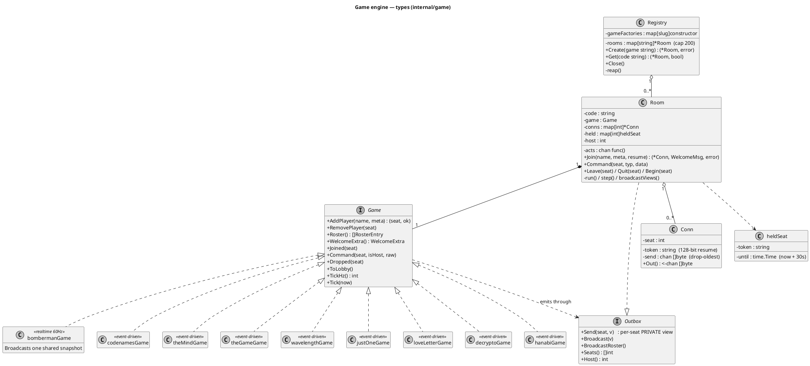
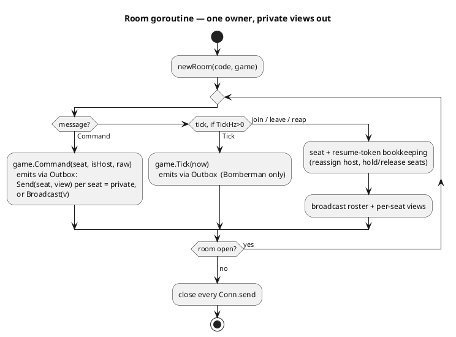
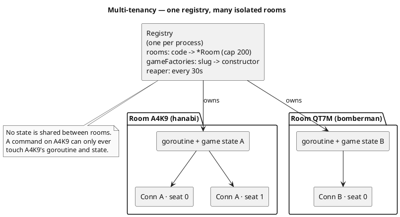
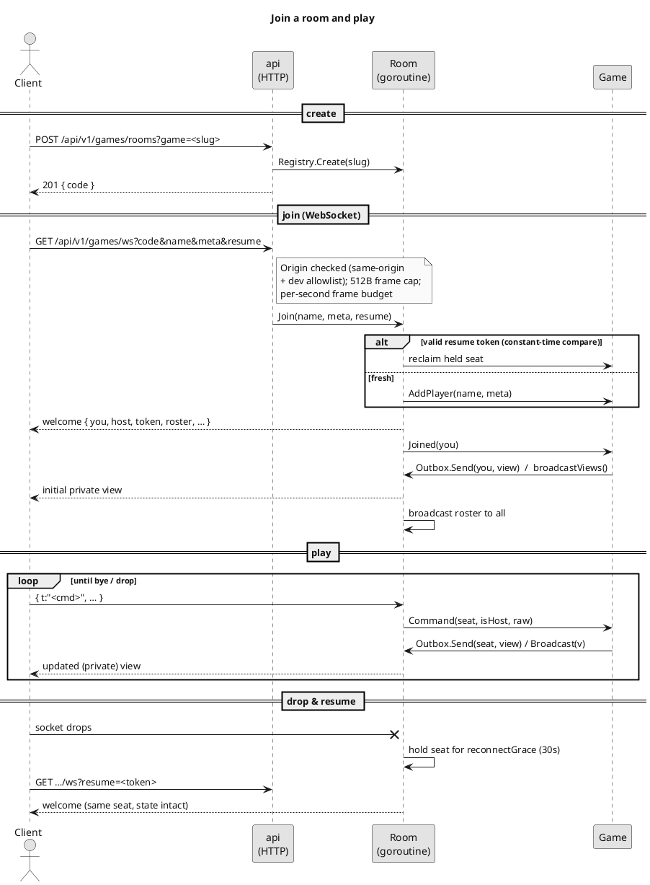
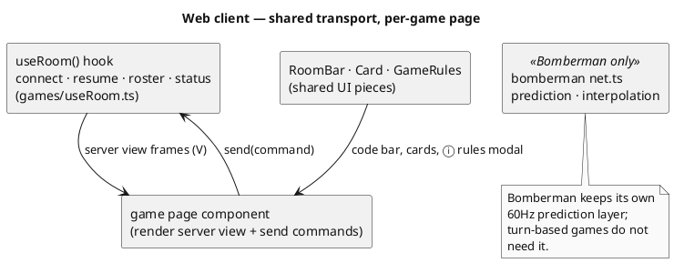

```table-of-contents
```

# Multiplayer games — engine architecture

How the realtime multiplayer layer is put together, how **many rooms run side by side in one process**, and how a **new game** plugs into it. The main [README](../README.md#games-multiplayer) covers Bomberman's netcode (prediction, interpolation) in depth; this document is about the **shared engine** underneath it, the per-room isolation model, and the per-game rules that every game adds.

As of **0.4.0** there are nine games on this engine: Bomberman, Codenames, The Mind, The Game, Wavelength, Just One, Love Letter, Decrypto and Hanabi. The full [game catalog](#game-catalog) documents each one.

## UML notation in this document

Every diagram here is **PlantUML**, rendered inline by Obsidian (and by any PlantUML viewer or the server at plantuml.com). Three diagram kinds are used:

| Diagram | PlantUML form | What it shows here |
| --- | --- | --- |
| **Class diagram** | `interface` / `class`, `..|>` realises, `*--` composition, `o--` aggregation, `..>` dependency | the Go types in `internal/game` and how they relate |
| **Activity diagram** | `start` / `repeat` / `if`, `stop` | the room goroutine's single-owner loop |
| **Sequence diagram** | `actor` / `participant`, `->` call, `-->` reply, `-x` drop | the join handshake, play loop and reconnect over the WebSocket |
| **Component diagram** | `[component]`, `-->` wiring | multi-tenancy (one registry, many isolated rooms) and the client transport |

Relationship arrows read: `A ..|> B` "A implements interface B", `A *-- B` "A owns a B (composition)", `A o-- B` "A holds Bs (aggregation)", `A ..> B` "A depends on / uses B". Stereotypes in guillemets (`<<one goroutine>>`) are notes, not code.

## The idea: one engine, many games

Everything that is *not* a game's rules is shared. A room is a code, a set of seats, reconnect tokens, a per-client send queue, an origin-checked WebSocket and a single goroutine that owns the state. Only the rules differ between games, so those live behind one `Game` interface and the engine drives them. A game is registered by slug in `gameFactories` (`engine.go`); `POST /games/rooms?game=slug` is all it takes to open a room running it.

The one capability these games need that Bomberman alone never did is **per-seat private views**: the Codenames spymaster sees the colour key and the guessers do not; in Love Letter you see your own hand and no one else's; in Hanabi it is inverted, you see everyone's hand *except* your own. So the room does not simply broadcast one state to all. On every change a turn-based game renders the view *each seat is allowed to see* and sends each seat its own frame.

Two engine modes cover all nine games:

- **Realtime** (`TickHz() > 0`): a server clock advances the simulation and broadcasts snapshots. **Bomberman only** (60 Hz). It uses `Outbox.Broadcast` because every player sees the same arena.
- **Event-driven** (`TickHz() == 0`): no game clock. The room only pushes when a command changed something, so an idle room sends nothing. **Every other game.** These use `Outbox.Send` per seat for private views.

## Package & type structure (Go)



**What each part owns**

| Part | Responsibility | Game-specific? |
| --- | --- | --- |
| `Registry` | room codes (crypto/rand, unguessable), the `gameFactories` slug table, capacity cap, idle reaping | no |
| `Room` | the single-goroutine loop, seats, reconnect/resume tokens, host, send queues, driving the `Game` | no |
| `Conn` | one client's seat, 128-bit resume token, and bounded drop-oldest send channel | no |
| `Game` | the rules: seating, commands, **per-seat view**, optional clock | **yes** |

`Registry`, `Room` and `Conn` are entirely game-agnostic. Bomberman's old `*Match` was lifted out of `Room` and behind `Game` in the 0.3.9 engine refactor, so `bombermanGame` is simply the first (and only realtime) implementation, wire protocol byte-identical to before.

## The `Game` interface

A game emits frames through the `Outbox` the room hands it, rather than returning a view to the room. **The private-view primitive is `Outbox.Send(seat, v)`:** on a change, an event-driven game loops `Outbox.Seats()` and sends each seat the output of its own `viewFor(seat)` helper (what that seat may see), via a small `broadcastViews()` wrapper. Bomberman instead calls `Outbox.Broadcast` with one shared snapshot. Every method below runs on the room goroutine, so a game needs no locks.

| Method | When the room calls it | Notes |
| --- | --- | --- |
| `AddPlayer(name, meta)` | on join (no resume) | `meta` is a free per-game string (totem slug, …); `ok=false` when full |
| `RemovePlayer(seat)` | when a held seat's grace lapses | |
| `Roster()` | the room builds a roster | slow-changing identities; the room folds in host + "gone" |
| `WelcomeExtra()` | on join | game-specific welcome fields (Bomberman: arena, fuse); turn games leave it zero |
| `Joined(seat)` | right after the welcome | push the initial view; event-driven games call `broadcastViews()` so everyone sees the newcomer |
| `Command(seat, isHost, raw)` | on each client frame | the game parses `raw`; `isHost` gates host-only actions like `start` |
| `Dropped(seat)` | socket dropped, seat held | Bomberman freezes that player; turn games re-broadcast views (the roster "gone" flag changes) |
| `ToLobby()` | once nobody is left to return | reset to the waiting state |
| `TickHz()` | at room start | `0` = event-driven (no clock, **every game but Bomberman**); `60` = Bomberman |
| `Tick(now)` | every tick when `TickHz() > 0` | advance the realtime sim; a nop on turn games |

Turn-based games (`TickHz()==0`) never run a game clock: the room only ticks slowly to reap held seats, and a game pushes through the `Outbox` only when a command changed something, so an idle Codenames room sends nothing.

## Per-seat private views (the shared trick)

This is the one mechanism worth understanding before reading any game. The room keeps the authoritative state inside the `Game`; it never serialises that state directly. Instead:

1. Something changes (a command, a join, a drop).
2. The game calls `broadcastViews()`, which loops `Outbox.Seats()`.
3. For each seat it builds `viewFor(seat)`: a struct containing **only what that seat is allowed to know**, and sends it with `Outbox.Send(seat, view)`.

So the secret never leaves the server for a client that is not entitled to it. The hidden thing differs per game (see the [catalog](#game-catalog)): a colour key, a single word, a hand of cards, a dial target, a 3-digit code. The shapes recur:

- **Role-asymmetric** (Codenames, Decrypto, Wavelength): one role or one team sees something the others do not. The spymaster's frame carries the key; a guesser's does not.
- **Own-hand** (Love Letter, The Game, The Mind): you see your own cards, others see only a count.
- **Hidden-from-one** (Just One): everyone sees the word except the guesser.
- **Inverted** (Hanabi): you see every hand **but** your own, plus whatever hints have revealed about yours.

> **The nil-slice gotcha.** A view sent to the client must never contain a nil slice: `encoding/json` serialises `nil` as `null`, and the client then does `.length` or `.map` on it and white-screens. Always build view slices with `append([]T{}, …)` (never `append([]T(nil), …)`), and guard the client side with `?? []`. This bit both card games once (see the 0.3.9 changelog) and the rule now holds for every game.

## Room lifecycle & the per-seat view loop



The room goroutine is the **only** thing that touches game state, so the game needs no locks and stays deterministic. Everything a connection goroutine wants to do is posted onto the room's `acts` channel and executed here, in order. A panic in game code is recovered per room (`Room.safely`) and logged, so one buggy game cannot take down the process or any other room.

## Multi-tenancy & isolation

One `totemd` process hosts **many independent rooms at once**, each potentially a different game, with no shared mutable state between them. The room code is the tenant key: it is the only thing that routes a client to a room, and the only thing guarding it.



**How isolation is enforced**

- **One goroutine per room.** A room owns its `Game` on a single goroutine; all mutation funnels through its `acts` channel. There is no lock and no cross-room pointer, so a command for one room is physically unable to reach another's state. A panic is contained to its room (`Room.safely`).
- **Codes are the tenant key, and unguessable.** A `CodeLen = 4` code is drawn from `crypto/rand` over a 32-symbol alphabet with the look-alike glyphs removed (no `0`/`O`, no `1`/`I`), because it gets read aloud across a field. That is ~1.05 million codes; collisions on `Create` just redraw. Knowing a code is the only way to address a room.
- **Capacity cap.** The registry holds at most `maxRooms = 200` rooms; `Create` returns `ErrTooManyRooms` past that. Opening a room allocates a goroutine, so creation is also rate-limited per IP at the HTTP layer.
- **Idle reaping.** A background reaper runs every `reapInterval = 30s` and closes any room that has been **empty** longer than `roomIdleTimeout = 2m`, freeing the goroutine and the code. A room with any connected or held seat is never reaped.
- **Per-connection limits.** Each socket has a `maxGameFrame = 512`-byte frame cap and a per-second frame budget (`maxClientMsgRate`, 4× the tick rate), and nicknames are validated server-side. A flooding or oversized client is dropped, not trusted.
- **Origin-checked upgrade.** The WebSocket upgrade only accepts an `Origin` whose host matches the `Host` the backend sees (same-origin). `TOTEM_ALLOWED_ORIGINS` widens that for the Vite dev proxy only; it is empty in production.

**The knobs, in one place**

| Constant | Value | Where | Meaning |
| --- | --- | --- | --- |
| `CodeLen` | 4 | `registry.go` | room-code length (32^4 ≈ 1.05M codes) |
| `maxRooms` | 200 | `registry.go` | process-wide room cap |
| `roomIdleTimeout` | 2 min | `registry.go` | empty-room grace before reaping |
| `reapInterval` | 30 s | `registry.go` | how often the reaper runs |
| `reconnectGrace` | 30 s | `room.go` | how long a dropped seat is held |
| resume token | 16 bytes (128-bit) | `room.go` | per-seat reconnect secret, base64url |
| `maxGameFrame` | 512 B | `api/games.go` | inbound frame size cap |
| `maxClientMsgRate` | 4 × TickHz | `api/games.go` | per-second inbound frame budget |

## Networking — handshake, protocol, reconnect



The frames on the wire are the same four for every game: `welcome` (seat, host, resume token, roster), `roster` (identities + host + "gone" flags), `state` (the per-seat view, each game's own shape) and `error`. The handshake, origin check, frame caps and resume-token flow are shared and unchanged from Bomberman. **What a game controls is only the message `t` values it accepts in `Command`, and the shape of the struct `viewFor` returns.**

## Client structure

Bomberman's client is heavy because it predicts and interpolates at 60 Hz. The turn-based games are the opposite: state changes rarely, so the client just renders whatever the server last sent. The transport is the shared part, and it exists today (it was "planned" when this doc was first written in 0.3.x).



The shared client pieces, all under `src/web/src/games/`:

- **`useRoom.ts`** — the game-agnostic transport hook, `useRoom<V>(code, name, meta?)`: connect, resume token, roster, reconnect with backoff, and the latest server view typed as `V`. No prediction. Turn-based pages read `g.view`, `g.you`, `g.host`, `g.status` and call `g.send(cmd)`.
- **`RoomBar.tsx`** — the header shared by every turn-based game: room code with a copy button, the game title, the ⓘ rules button, and Leave.
- **`Card.tsx`** — a CSS playing card (no image assets) coloured by its value band, used by The Game and The Mind.
- **`GameRules.tsx` + `rules.ts`** — the ⓘ "how to play" modal and its per-game content (summary, numbered steps, worked example), reachable from the index and in-game.

New game on the client = one entry in the `GAMES` array in `games/GamesPage.tsx`, one route in `App.tsx`, a page component, a `rules.ts` entry, and i18n title/blurb keys. See [Adding a new game](#adding-a-new-game).

## Game catalog

Every game reuses the whole engine; the per-game notes below are **all it adds**. Rules follow the published editions; where a game simplifies the boxed rules for online play it is flagged. "References" are the open-source implementations or rulebooks the rules were lifted from (never invented). Backend file is under `internal/game/`; the client page under `src/web/src/games/`.

### Bomberman — realtime arena
- **Players / type:** 2–4, free-for-all. **Engine:** realtime, `TickHz 60`.
- **Private view:** none; one shared arena snapshot is broadcast. This is the only game that predicts and interpolates client-side.
- **State:** a 15×13 wall/crate grid (seeded), players, bombs, blasts, power-ups.
- **Commands:** `input` (direction + bomb key, sequence-numbered), `start`, `restart`, `bye`.
- **Win:** last player standing takes the round; the host starts the next.
- **Detail:** the whole netcode (server-authoritative sim, prediction, reconciliation, the F3 HUD) is documented in the [README](../README.md#netcode). **File:** `bomberman.go` (+ `arena.go`, `sim.go`, `state.go`). **Client:** `bomberman/` (+ `net.ts`, `render.ts`, `movement.ts`).

### Codenames — two-team word grid
- **Players / type:** 4–10, two teams. **Engine:** event-driven.
- **Private view (role-asymmetric):** both **spymasters** see the 5×5 colour key (which tiles are their agents, the enemy's, bystanders, the assassin); guessers see only revealed tiles. The first to claim spymaster on a team keeps it.
- **State:** 25 words, the colour key, revealed tiles, current clue + count, whose turn, scores.
- **Commands:** `clue(word, count)` (spymaster), `guess(tile)` / `endturn` (guessers), `start` / `restart`.
- **Win:** reveal all your team's agents; tap the assassin and you lose instantly.
- **Refs:** [lxu213](https://github.com/lxu213/codenames), [cmkoller](https://github.com/cmkoller/codenames), [koldoon](https://github.com/koldoon/codenames-game). 403-word deck. **File:** `codenames.go` (7 tests). **Client:** `codenames/CodenamesPage.tsx`.

### The Mind — co-op nerve
- **Players / type:** 2–4, co-op. **Engine:** event-driven (no clock; timing is human nerve, not a server timer).
- **Private view (own-hand):** you see your own cards; others see only the shared pile and counts.
- **State:** level, lives, stars (shurikens), the ascending shared pile, per-player hands.
- **Commands:** `play` (your lowest card, by feel), `star` (vote a throwing star), `next` (host: start the next round after a clear), `start` / `restart`.
- **Win:** clear the final level (12/10/8 for 2/3/4 players). Playing out of order burns a life and every lower card still held; the HUD flashes a breaking heart. Clearing a level grants milestone **bonus stars** (levels 2,3,5,6,8,9) and **lives** (3,6,9), and the finished board is held until the host presses **Next round**.
- **Refs:** [RafeArnold](https://github.com/RafeArnold/the-mind), [JonSeijo](https://github.com/JonSeijo/the-mind-online), [oraki23](https://github.com/oraki23/TheMindOnline). **File:** `mind.go` (7 tests). **Client:** `themind/MindPage.tsx`.

### The Game — co-op card descent
- **Players / type:** 1–5, co-op. **Engine:** event-driven.
- **Private view (own-hand):** your hand is yours; piles and counts are public.
- **State:** four piles (two up from 1, two down from 100), draw deck, hands (8/7/6 for 1/2/3–5), per-pile history, reserved ("called") piles, whose turn (a random player begins).
- **Commands:** `play(card, pile)` (≥2 per turn, 1 once the deck is empty, with the "exactly 10 back" reverse trick), `reserve(pile)` (✋ flag a pile), `endturn`, `start` / `restart`.
- **Win:** play every card. Lose if a player cannot make their minimum.
- **Ref:** [spiel-des-jahres.de](https://www.spiel-des-jahres.de/en/games/the-game/) / [lschlesinger/the-game](https://github.com/lschlesinger/the-game). **File:** `thegame.go` (6 tests). **Client:** `thegame/TheGamePage.tsx`.

### Wavelength — two-team spectrum
- **Players / type:** 4–12, two teams. **Engine:** event-driven.
- **Private view (role-asymmetric):** only the current **psychic** sees the hidden target zone on the 0–20 dial; their team and the opponents do not.
- **State:** the spectrum concept pair, the hidden target, the dial, the clue, the opponents' left/right bet, scores, teams.
- **Commands:** `clue(text)`, `setDial`, `bet(left|right)`, `lockIn`, `start` / `restart`.
- **Win:** first team to 10. Scoring 4/3/2/0 by dial distance, +1 for a correct bet. Needs 2+ per team.
- **Ref:** [cynicaloptimist/longwave](https://github.com/cynicaloptimist/longwave) (MIT), 168-pair deck. **File:** `wavelength.go` (5 tests). **Client:** `wavelength/WavelengthPage.tsx`.

### Just One — co-op one-word clues
- **Players / type:** 3–8, co-op. **Engine:** event-driven.
- **Private view (hidden-from-one):** everyone sees the mystery word **except** the rotating guesser, whose frame omits it until the result.
- **State:** the word, the rotating guesser, each writer's clue, the surviving (non-duplicate) clues, round number, score.
- **Commands:** `start`, `clue(word)` (writers), `guess(word)` / `pass` (guesser), `next` (host), `restart`.
- **Win:** co-op score over 13 rounds. Identical (case-insensitive) clues, and clues equal to the word, cancel out before the guesser sees them.
- **Simplification:** a wrong guess scores nothing (no penalty-card rule). Reuses the Codenames word deck. **File:** `justone.go` (4 tests). **Client:** `justone/JustOnePage.tsx`.

### Love Letter — deduction knockout
- **Players / type:** 2–4, free-for-all. **Engine:** event-driven.
- **Private view (own-hand + targeted reveal):** you see only your own hand; a Priest sends its player a **private** peek at one rival's card.
- **State:** per-player hand (1–2 cards), discards, out/protected flags, tokens, the deck, the set-aside card, the 2-player face-up cards.
- **Commands:** `play(card, target, guess)` (the card's effect decides which of target/guess apply), `next` (host), `restart`.
- **Win:** last player in, or the highest card at a drained deck (discard-sum tiebreak), wins a token; first to 7/5/4 tokens for 2/3/4 players wins. The eight cards: Guard(1) guess, Priest(2) peek, Baron(3) compare, Handmaid(4) protect, Prince(5) force-discard, King(6) swap, Countess(7) forced with royalty, Princess(8) out if discarded.
- **Ref:** standard edition rulebook. **File:** `loveletter.go` (5 tests). **Client:** `loveletter/LoveLetterPage.tsx`.

### Decrypto — two-team code clues
- **Players / type:** 4–8 (two teams of 2+). **Engine:** event-driven.
- **Private view (role-asymmetric):** a team sees only its own four secret words; the 3-digit code is shown only to the round's encryptor until the reveal.
- **State:** each team's four words, the code (distinct digits 1–4), the three clues, both teams' guesses, interception/miscommunication tokens, the public history of past clues, scores.
- **Commands:** `start`, `clue([3])` (encryptor), `decode([3])` (active team), `intercept([3])` (other team), `next` (host), `restart`.
- **Win:** intercept the enemy code twice to win; miss your own twice to lose; otherwise most interceptions after 8 rounds.
- **Simplification:** the teams **alternate** as the encrypting team rather than both encrypting every round. Reuses the Codenames word deck. **File:** `decrypto.go` (4 tests). **Client:** `decrypto/DecryptoPage.tsx`.

### Hanabi — co-op inverted-hand fireworks
- **Players / type:** 2–5, co-op. **Engine:** event-driven.
- **Private view (inverted):** you are sent the **faces of everyone else's cards** but only what hints have revealed about your own (both positive "this is red" and negative "these are not 3s" knowledge are tracked).
- **State:** 50-card deck (5 colours × 1,1,1,2,2,3,3,4,4,5), each hand (4–5 cards), five colour stacks, discards, 8 hint tokens, 3 fuses, whose turn, the final-round countdown.
- **Commands:** `hint(target, kind:color|value, value)` (spend a token, marks all matching cards), `discard(card)` (regain a token), `play(card)`, `restart`.
- **Win:** build five stacks 1→5 (perfect 25). A misplay burns a fuse; three blown fuses end the show. Completing a stack returns a hint token; the deck emptying triggers one final turn each. Score is the sum of the stack tops.
- **Ref:** standard edition rulebook. **File:** `hanabi.go` (6 tests). **Client:** `hanabi/HanabiPage.tsx`.

## Adding a new game

The engine is the fixed part; a new game is a backend `Game` plus a client page.

**Backend (`internal/game/<game>.go`)**

1. Define a struct with `out Outbox`, an `rng *rand.Rand` (seed via `rand.NewPCG`), the players/order, a `phase`, and the rules state.
2. Write a `new<Game>Game(out Outbox, seed uint64) Game` constructor.
3. Implement the `Game` interface. For a turn-based game: `TickHz()` returns `0`, `Tick` is a nop, `Joined`/`Dropped`/`ToLobby` call `broadcastViews()`.
4. Write `viewFor(seat)` returning only what that seat may see, and `broadcastViews()` looping `Outbox.Seats()`. **Build every slice with `append([]T{}, …)`** so none serialises as `null`.
5. Register the slug in `gameFactories` (`engine.go`).
6. Add a `<game>_test.go` that drives `Command` through a `fakeOutbox` and asserts the private view hides what it should, plus the win/lose transitions.

**Client (`src/web/src/games/<game>/`)**

7. A `<Game>Page.tsx` using `useRoom<V>(code, name)` + `RoomBar`. Define the view type `V` to match `viewFor`'s JSON. Render the server view; never predict.
8. Add the slug to the `GAMES` array (`GamesPage.tsx`) and a route (`App.tsx`).
9. Add a `rules.ts` entry (summary, steps, example) and i18n title/blurb keys in all three languages (`i18n.ts`). Add any CSS to `styles.css`.

**Verify** (the Go toolchain lives on the dev box): `gofmt -w internal/game/*.go && go build ./... && go vet ./internal/game/ && go test ./internal/game/`, then on the client `tsc --noEmit`, `vitest run` and `npm run build`. A smoke test is `POST /api/v1/games/rooms?game=<slug>` returning 201.

## History

The engine refactor (0.3.9) lifted Bomberman's `*Match` out of `Room` behind the `Game`/`Outbox` interfaces, proving the seam with zero behaviour change. The turn-based games were then built in the order **Codenames → The Mind → The Game → Wavelength** (0.3.9), each exercising a private-view shape, followed by **Just One, Love Letter, Decrypto and Hanabi** (0.4.0). All nine now run side by side on the same engine; Bomberman is just the one realtime `Game` among them.
